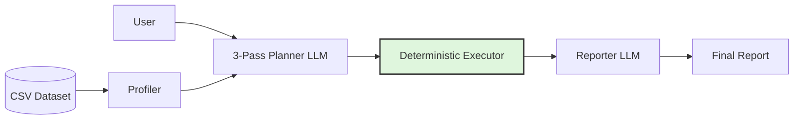

# Scrygent

[](https://www.python.org/downloads/)
[](https://python.langchain.com/docs/langgraph)
[](https://docs.pydantic.dev/latest/)

Scrygent is a deterministic data analytics engine built on a single architectural bet: **LLMs should plan queries, not execute them.**

Most "chat with your data" projects wrap LangChain's Pandas agent, letting the model write, execute, and debug arbitrary Python in a loop. That approach leads to hallucinated mathematics, non-reproducible outputs, and fragile execution paths. 

Scrygent replaces code generation with a **Plan-and-Execute Compiler**. It translates natural language into a strict Pydantic Intermediate Representation (IR). All math, filtering, and aggregation is then executed exclusively by a handwritten, deterministic Python engine. The LLM decides *what* to compute; the engine decides *how*.

---

## The Architectural Trade-offs

Building a deterministic compiler requires deliberate trade-offs between latency, cognitive load, and reliability. 

### 1. The 3-Pass Planning Pipeline (Latency vs. Accuracy)
Forcing an LLM to simultaneously reason about data logic, optimize execution order, and perfectly format deeply nested JSON arrays causes cognitive overload (resulting in dropped parameters and Pydantic validation failures). 

To solve this, Scrygent's Planner Node acts as a 3-pass compiler:
1. **High-Level Parser (AST):** Extracts logical intent without worrying about schema syntax.
2. **Middle-End Optimizer:** Applies database-style heuristics (e.g., filter pushdowns, metric consolidation, group-by optimizations).
3. **IR Emission:** Translates the optimized AST into the final strict JSON payloads.

**The Trade-off:** This requires three sequential LLM calls, adding roughly 2–3 seconds of latency to the planning phase. 
**The Return:** It virtually eliminates schema hallucinations and ensures optimized data routing, treating the LLM as a reliable query optimizer rather than a fragile scripter.

### 2. Engineering for Production Realities
Scrygent implements several unglamorous but critical guards against common agentic failure modes:

* **C-Type JSON Boundary Sanitization:** Pandas and NumPy operations inherently produce C-types (`np.int64`, `pd.NaT`, `np.nan`) that crash standard JSON serializers and downstream LLM APIs. Scrygent intercepts this via `ScrygentBaseModel`, applying a recursive `@model_validator` to scrub and cast all data to native Python primitives at the state boundary.
* **Dual-Guarded Replanning:** If the planner lacks statistical context, it executes a constrained lazy-fetch step. To prevent the agent from getting stuck in an infinite fetch loop, Scrygent enforces a strict plan-level structural constraint *and* a hard session-level state guard (`has_replanned`).
* **Self-Healing Execution:** When an execution fails (e.g., a hallucinated column name or violated enum), the system does not crash. The Python exception is routed through an internal `resilience` correction loop, forcing the LLM to repair its own payload syntax before execution continues.

---

## System Architecture



1. **Profiler:** Deterministically extracts global schemas, null rates, and query-aware statistics to minimize prompt size.
2. **Planner:** Emits the strict Intermediate Representation (IR).
3. **Executor:** The only component allowed to manipulate data. Dispatches JSON payloads to a handwritten, stateless suite of pure Python tools (filtering, regression, outlier detection).
4. **Reporter:** Synthesizes the final report. Its prompt enforces a strict separation: direct answers first, secondary insights only if mathematically supported by the tool outputs.

---

## Technology Stack

*Note: Scrygent is designed as a stateless, single-pass engine suitable for ephemeral cloud deployments (e.g., Streamlit Cloud).*

| Layer                  | Technology       | Rationale |
| ---------------------- | ---------------- | --------- |
| **Workflow Orchestration** | LangGraph        | Explicit graph structure, clean cyclic routing, strict state management. |
| **Data Validation**    | Pydantic v2      | Recursive serialization and strict JSON schema enforcement at boundaries. |
| **Data Engine**        | Pandas 3.x, NumPy| Standard, strictly-typed C-backend data manipulation. |
| **Safe Math**          | numexpr          | Securely evaluates row-wise math without exposing Python's `eval()`. |
| **LLM Providers**      | Groq, OpenRouter | Provider-agnostic abstraction for fast structured JSON generation. |
| **Long-Term Memory**   | Qdrant FastEmbed | CPU-bound local embeddings stored in a serverless vector DB for Experience Replay. |
| **UI**                 | Streamlit        | Fast presentation layer. |

---

## Local Development

Clone the repository:
```bash
git clone https://github.com/mohamadmeri/scrygent
cd scrygent
```

Install dependencies using `uv` for fast, deterministic builds:
```bash
uv sync
```

Create a secrets file:
```bash
cp .streamlit/secrets.toml.example .streamlit/secrets.toml
```

Populate `.streamlit/secrets.toml` with your API credentials:
```toml
GROQ_API_KEY = "..."
OPENROUTER_API_KEY = "..."
QDRANT_URL = "..."
QDRANT_API_KEY = "..."
```

Run the application:
```bash
uv run streamlit run app.py
```

---

## Documentation & Deep Dive

For a comprehensive explanation of the compiler architecture, dependency hierarchy (The Golden Rule), graph routing, and semantic memory implementation, see:

[**docs/ARCHITECTURE.md**](docs/ARCHITECTURE.md)
