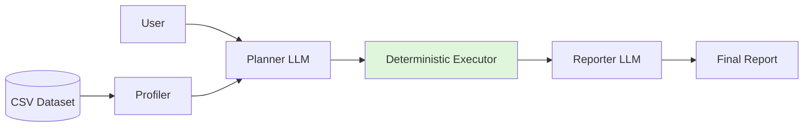
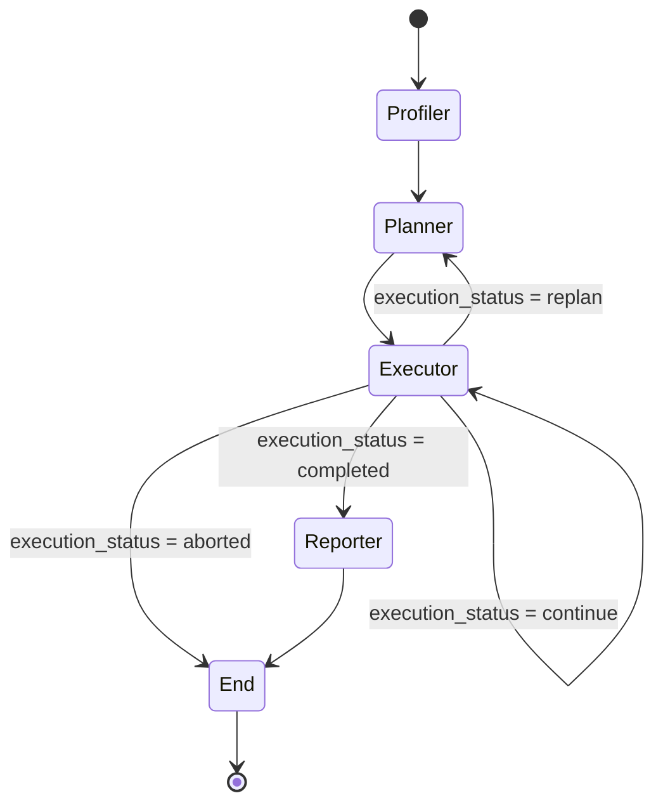

# Scrygent

### Technical Foundation
[](https://www.python.org/downloads/)
[](https://python.langchain.com/docs/langgraph)
[](https://docs.pydantic.dev/latest/)

### Design Philosophy
[](docs/ARCHITECTURE.md#strict-determinism-no-sandbox)
[](docs/ARCHITECTURE.md#the-plan-and-execute-compiler)
[](./docs/ARCHITECTURE.md#the-self-healing-correction-loop)

> **Upload a CSV. Ask a question in plain English. Get a mathematically verified report.**

Scrygent is an autonomous data analysis system that combines Large Language Models with a deterministic execution engine. Instead of generating Python code and hoping it runs correctly, Scrygent compiles natural language into a strict Intermediate Representation (IR) and executes it through a curated suite of handwritten analytical tools.

The LLM is responsible for understanding intent only. Every calculation, aggregation, regression, visualization, and statistical operation is performed by deterministic Python code using Pandas, NumPy, and numexpr. The result is an architecture that produces mathematically verified outputs while eliminating hallucinated calculations and unsafe code generation.

---

## Architecture at a Glance

```text
Natural Language
        │
        ▼
   Planner LLM
        │
        ▼
 Strict Pydantic IR
        │
        ▼
Deterministic Compiler
        │
        ▼
 Pandas / NumPy / numexpr
        │
        ▼
  Verified Report
```



---

# Why Scrygent?

Traditional AI data agents typically generate Python code, repeatedly execute it, inspect the output, generate more code, and hope the final result is correct.

That approach has several drawbacks:

* reasoning loops that consume context
* fragile generated code
* hallucinated calculations
* inconsistent execution
* security concerns around arbitrary code generation

Scrygent follows a different architecture.

The planner never writes executable Python. Instead, it emits a strict JSON Intermediate Representation describing **what** should be computed. A deterministic compiler handles **how** it is computed.

```
Natural Language
        │
        ▼
Planner LLM
        │
        ▼
Strict Pydantic IR
        │
        ▼
Deterministic Python Compiler
        │
        ▼
Verified Mathematical Results
```

This separation makes every numerical result traceable to deterministic code rather than language-model reasoning.

---

# Key Features

### Deterministic Analytics

Every aggregation, statistic, regression, visualization, filter, and derived metric is computed by handwritten Python tools.

The LLM never performs arithmetic.

---

### Plan-and-Execute Compiler

Natural language is compiled into a strongly typed Intermediate Representation rather than executable Python.

This provides:

* deterministic execution
* schema validation
* fast failure
* reproducible analyses
* safer execution

---

### Strict Pydantic Contracts

Every tool consumes validated Pydantic models.

Malformed plans fail immediately instead of silently producing incorrect analyses.

---

### Self-Healing Execution

Execution errors are not returned directly to the user.

Instead, Python exceptions are routed through a constrained correction loop where the planner repairs invalid parameters before execution continues.

Examples include:

* nonexistent columns
* invalid enum values
* malformed tool parameters
* schema violations

---

### Intelligent Dataset Profiling

Before planning begins, Scrygent performs deterministic profiling of the uploaded dataset.

The profiler provides:

* complete schema
* data types
* null statistics
* representative row samples
* query-aware detailed statistics
* lazy statistical enrichment through constrained replanning

This minimizes prompt size while ensuring the planner never guesses data distributions.

---

### Constrained Re-Planning

If additional statistical information is required, the planner cannot guess.

Instead it performs a controlled re-plan cycle:

Planner → request statistics → deterministic profiler → Planner

This guarantees planning decisions are based on verified dataset metadata.

---

### Semantic Experience Memory

Successful execution plans are automatically stored in a serverless vector database.

Future queries retrieve structurally similar successful plans as few-shot examples, allowing the planner to improve over time without retraining.

---

### Provider Agnostic LLM Layer

Scrygent currently supports multiple providers behind a single abstraction layer.

Switching providers requires only configuration changes rather than application changes.

---

### Zero Arbitrary Code Execution

No `exec()`.

No sandbox.

No generated Python.

Cross-column mathematical expressions are evaluated safely using `numexpr` under a restricted namespace.

---

# Execution Graph

Scrygent is orchestrated using LangGraph.

The graph explicitly controls execution through deterministic state transitions. The planner is responsible only for producing plans, while the executor is the only component allowed to manipulate data. Missing metadata and execution failures trigger controlled recovery loops instead of unconstrained reasoning.



---

# Compiler Pipeline

The central architectural idea behind Scrygent is separating reasoning from execution.


The planner determines **what** should happen.

The deterministic execution engine determines **how** it happens.

---

# Technology Stack

| Layer                  | Technology       |
| ---------------------- | ---------------- |
| UI                     | Streamlit        |
| Workflow Orchestration | LangGraph        |
| LLM Providers          | Groq, OpenRouter |
| Structured Output      | LangChain        |
| Data Engine            | Pandas 3.x       |
| Numerical Computing    | NumPy            |
| Safe Expression Engine | numexpr          |
| Data Validation        | Pydantic v2      |
| Long-Term Memory       | Upstash Vector   |
| Dependency Management  | uv               |

---

# Engineering Highlights

Some implementation details that are easy to miss from the UI but form the core of the project:

* strict layered architecture preventing circular dependencies
* handwritten deterministic analytical tool suite
* compiler-style Intermediate Representation instead of Python generation
* recursive JSON sanitization at model boundaries
* lazy dataset profiling for token efficiency
* deterministic execution pipeline
* provider-independent LLM abstraction
* semantic experience replay using vector retrieval
* robust validation with automatic recovery
* strongly typed execution contracts throughout the system

---

# Local Development

Clone the repository.

```bash
git clone https://github.com/mohamadmeri/scrygent
cd scrygent
```

Install dependencies.

```bash
uv sync
```

Create a secrets file.

```bash
cp .streamlit/secrets.toml.example .streamlit/secrets.toml
```

Populate it with your credentials.

```toml
GROQ_API_KEY = "..."
OPENROUTER_API_KEY = "..."
UPSTASH_VECTOR_REST_URL = "..."
UPSTASH_VECTOR_REST_TOKEN = "..."
```

Run the application.

```bash
uv run streamlit run app.py
```

---

# Documentation

For a deeper explanation of the compiler architecture, dependency hierarchy, graph routing, deterministic execution model, and design rationale, see:

```
docs/ARCHITECTURE.md
```

---

# Evaluation

The evaluation suite is currently a work in progress.

Planned benchmarks include:

* planner success rate
* correction-loop success rate
* re-planning frequency
* end-to-end task completion
* execution latency
* token consumption
* comparison against code-generation based agents

Benchmark results will be published once the evaluation framework is complete.

---

# Roadmap

* Expanded deterministic analytical tool suite
* Larger semantic experience memory
* Comprehensive benchmark suite
* Multi-dataset workflows
* SQL backend support
* Improved visualization capabilities
* Additional execution optimizations
