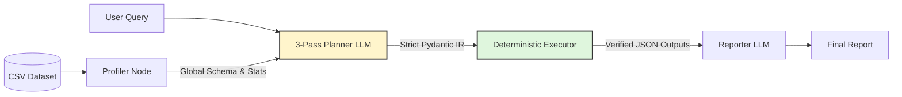

<div align="center">
  <picture>
    <source media="(prefers-color-scheme: dark)" srcset="docs/assets/logo-dark-theme.jpeg">
    <source media="(prefers-color-scheme: light)" srcset="docs/assets/logo-light-theme.jpeg">
    
  </picture>

  # Scrygent
  
  **A Strictly Typed Compiler Engine for Data Analysis**
  
  [](https://www.python.org/downloads/)
  [](https://langchain-ai.github.io/langgraph/)
  [](https://docs.pydantic.dev/latest/)
  []()
  []()
</div>

<br/>

<div align="center">
  <!-- TODO: Insert final UI screenshot here -->
  
  <p><em>The IDE-style compilation interface. (Deployment: WIP)</em></p>
</div>

<br/>

> **Scrygent is not a generic "chat with your data" agent.** It is a disciplined, strictly typed compiler that translates natural language into static, immutable execution graphs. The LLM decides *what* to compute; the deterministic Python engine decides *how*. Zero code generation. Zero hallucinated mathematics.

---

## Navigation

| Module | Description |
| :--- | :--- |
| [**Architecture**](docs/ARCHITECTURE.md) | Deep dive into the 3-pass compiler, dependency hierarchy, and self-healing loops. |
| [**Benchmarks (WIP)**](#benchmarks--evaluation) | Empirical evaluation metrics against DABench and DataBench Lite. *(WIP)* |

---

## System Architecture

Scrygent abandons the fragile "ReAct" loop of generating and executing arbitrary Python. Instead, it utilizes a **Plan-and-Execute Compiler** pipeline.



1. **Profiler:** Deterministically extracts global schemas and query-aware statistics to minimize prompt size.
2. **Planner:** A 3-pass compiler (Parser → Optimizer → IR Emitter) that translates intent into strict JSON.
3. **Executor:** Dispatches validated payloads to a handwritten, stateless suite of pure Python tools.
4. **Reporter:** Synthesizes the final report, strictly constrained to verified tool outputs.

---

## Key Engineering Highlights

These implementation details form the core of Scrygent's reliability and are designed to be defended in technical interviews:

*   **The 3-Pass Compiler Pipeline:** Forcing an LLM to simultaneously reason about data logic and format deeply nested JSON causes cognitive overload. Scrygent separates this into three distinct passes: an abstract Parser, a heuristic Optimizer (applying filter pushdowns and metric consolidation), and a strict IR Emitter locked behind `json_mode`.
*   **The Hermetic JSON Boundary:** Pandas and NumPy operations inherently produce C-types (`np.int64`, `pd.NaT`, `np.nan`) that crash standard JSON serializers. Scrygent intercepts this via `ScrygentBaseModel`, applying a recursive `@model_validator(mode="wrap")` to scrub and cast all data to native Python primitives at the exact moment of state assignment.
*   **Self-Healing Execution with Actionable Context:** When an execution fails (e.g., a hallucinated column name), the system does not crash or trigger a global graph back-edge. The Python exception is caught, enriched with the *exact list of available columns*, and routed through an internal LLM correction loop. The LLM repairs its own payload syntax mid-flight.
*   **The Multi-Step Composition Pattern:** Tools never pass massive DataFrames through the LangGraph state. Transforming tools (`filter_dataset`, `derive_column`) write their output to a secure, temporary CSV and update `AgentState.current_csv_path`. Subsequent steps naturally inherit the filtered data, maintaining the stateless-tools rule.
*   **Semantic Experience Replay:** Successful execution plans are automatically embedded and stored in a Qdrant vector database. Future queries retrieve structurally similar past plans as few-shot examples, allowing the planner to improve over time without retraining.

---
## Benchmarks & Evaluation

Scrygent is evaluated against industry-standard benchmarks to validate its deterministic approach against code-generation agents.

### Active Benchmarks

| Benchmark | Dataset | Questions | Status |
| :--- | :--- | :--- | :--- |
| **InfiAgent-DABench** (ICML 2024) | 124 CSVs | 603 questions | 🟡 In Progress |
| **DataBench Lite** (SemEval 2025) | 80 datasets | 1,822 questions | 🟡 In Progress |

### Evaluation Methodology

- **Mode:** `eval_mode=True` in `AgentState` forces the Reporter to output only `DirectAnswer` (no narrative, no plots)
- **Baseline:** GPT-4 achieves **78.99%** accuracy on DABench
- **Target:** Llama 3.3 70B backbone with deterministic advantage on standard statistical queries
- **Metrics Tracked:**
  - Planner schema validity rate
  - Correction-loop success rate  
  - End-to-end task completion
  - Latency breakdown by compiler pass
  - Schema failure rate (with vs. without 3-pass split)

### Robustness Testing

We generate "poisoned" variants of clean benchmark CSVs to test error handling:
- UTF-16/CP1252 encodings
- Semicolon/pipe delimiters
- Mixed-type columns (numeric + string artifacts)
- Missing headers, offset data rows

**See [`scripts/run_benchmark.py`](scripts/run_benchmark.py) for the evaluation harness.**

---

## Technology Stack

| Layer | Technology | Rationale |
| :--- | :--- | :--- |
| **Workflow Orchestration** | LangGraph | Explicit graph structure, clean cyclic routing, strict state management. |
| **Data Validation** | Pydantic v2 | Recursive serialization and strict JSON schema enforcement at boundaries. |
| **Data Engine** | Pandas 3.x, NumPy | Standard, strictly-typed C-backend data manipulation. |
| **Safe Math** | numexpr | Securely evaluates row-wise math without exposing Python's `eval()`. |
| **LLM Providers** | Groq, OpenRouter | Provider-agnostic abstraction for fast structured JSON generation. |
| **Long-Term Memory** | Qdrant, HuggingFace | Serverless vector DB and embeddings for Experience Replay. |
| **UI** | Streamlit | Modular, IDE-style presentation layer. |
| **Dependency Mgmt** | uv | Fast, deterministic builds and strict lockfile resolution. |

---

## Local Development

Clone the repository and initialize the environment using `uv` for fast, deterministic builds:

```bash
git clone https://github.com/mohamadmeri/scrygent.git
cd scrygent
uv sync
```

Create a secrets file and populate it with your API credentials:

```bash
cp .streamlit/secrets.toml.example .streamlit/secrets.toml
```

```toml
# .streamlit/secrets.toml
GROQ_API_KEY = "..."
OPENROUTER_API_KEY = "..."
QDRANT_URL = "..."
QDRANT_API_KEY = "..."
HF_API_TOKEN = "..."
```

Run the application:

```bash
uv run streamlit run app.py
```

---

## Deep Dive Documentation

For a comprehensive explanation of the compiler architecture, the Dependency Golden Rule, graph routing mechanics, and the self-healing correction loops, see:

**[Read the Architecture Document](docs/ARCHITECTURE.md)**