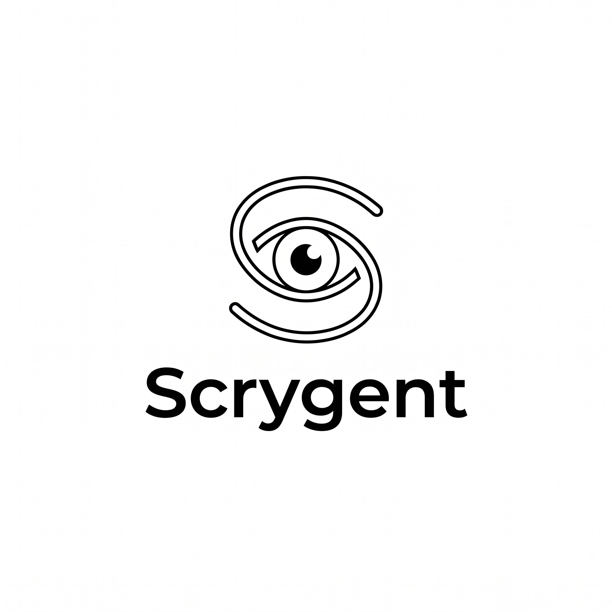
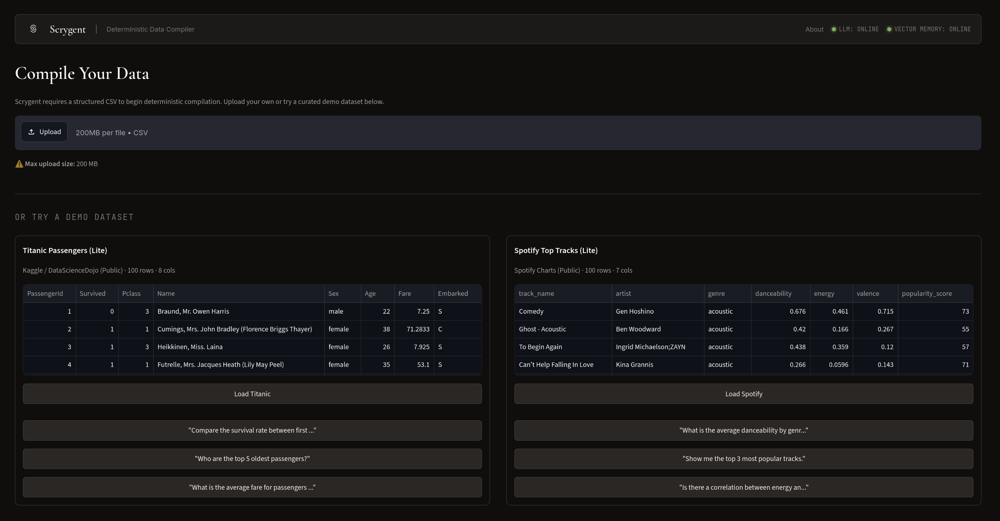
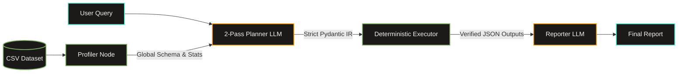

<div align="center">
  <picture>
    <source media="(prefers-color-scheme: dark)" srcset="docs/assets/logo-dark-theme.jpeg">
    <source media="(prefers-color-scheme: light)" srcset="docs/assets/logo-light-theme.jpeg">
    
  </picture>
  <h1>Scrygent</h1>
  <p><strong>A Strictly Typed Compiler Engine for Data Analysis</strong></p>

  [](https://github.com/mohamadmeri/scrygent/actions/workflows/ci.yml)
  [](https://codecov.io/gh/mohamadmeri/scrygent)
  [](https://github.com/astral-sh/ruff)
  [](https://www.python.org/)
  [](LICENSE)

  <br/>

  ### 🚀 [Try the Live Demo](https://https://scrygent.netlify.app/)

</div>

<br/>

<div align="center">
  
  <p><em>The deployed Streamlit compilation interface. Upload any CSV and ask questions in plain English.</em></p>
</div>

<br/>

> **Scrygent is a strictly typed compiler engine for data analysis.** It translates natural language into static, immutable execution graphs. The LLM decides *what* to compute. The deterministic Python engine decides *how*. Zero code generation. Zero hallucinated mathematics.

---

## Navigation

| Module | Description |
| :--- | :--- |
| [**Architecture**](docs/ARCHITECTURE.md) | Deep dive into the 2-pass compiler, dependency hierarchy, and self-healing loops. |
| [**Benchmarks (WIP)**](#benchmarks--evaluation-wip) | Empirical evaluation metrics against DABench and DataBench Lite. *(WIP)* |

---

## System Architecture

Scrygent abandons the fragile "ReAct" loop of generating and executing arbitrary Python. Instead, it utilizes a **Plan-and-Execute Compiler** pipeline.



1. **Profiler:** Extracts global schemas and query-aware statistics deterministically. This minimizes prompt size.
2. **Planner:** Translates intent into strict JSON using a 2-pass compiler (Parser → IR Emitter).
3. **Executor:** Dispatches validated payloads to a handwritten, stateless suite of pure Python tools.
4. **Reporter:** Synthesizes the final report. It strictly constrains output to verified tool results.

---

## Key Engineering Highlights

These implementation details form the core of Scrygent's reliability.

*   **The 2-Pass Compiler Pipeline:** Forcing an LLM to simultaneously reason about data logic and format nested JSON causes cognitive overload. Scrygent separates this into two distinct passes: an abstract Parser and a strict IR Emitter locked behind `json_mode`. The system removes the intermediate "Optimizer" pass. LLM-side query optimization yields diminishing returns compared to the latency and token costs. The deterministic Python executor is already highly optimized.
*   **Prompt Caching & Context Efficiency:** Scrygent consolidates static rules into a `SHARED_COMPILER_PREFIX`. This maximizes KV-cache hit rates on LLM providers. It reduces latency and token costs.
*   **Decoupled Model Routing:** Scrygent separates Planner models (Reasoning/Formatting) from the Reporter model via `pydantic-settings`. This allows fast models for JSON emission and heavy models for natural language synthesis.
*   **The Hermetic JSON Boundary:** Pandas and NumPy operations produce C-types (`np.int64`, `pd.NaT`, `np.nan`). These C-types crash standard JSON serializers. Scrygent intercepts this via `ScrygentBaseModel`. It applies a recursive `@model_validator(mode="wrap")` to scrub and cast all data to native Python primitives at the exact moment of state assignment.
*   **Materialized Aggregation State:** The `analyze_data` tool persists grouped and metric results to a temporary CSV. It returns `current_csv_path`. This allows downstream tools (like `generate_plot`) to read newly created metric aliases.
*   **Strict Behavioral Directives:** Scrygent enforces prompt directives to eliminate LLM blind spots. These include `ENTITY vs. VALUE`, `COMPARISONS & STATE PRESERVATION` (preventing destructive filter chaining), `DERIVE_COLUMN LIMITATIONS` (forbidding Python `if/else` in arithmetic), and `STRICT SCHEMA ADHERENCE`.
*   **Self-Healing Execution with Actionable Context:** Execution failures do not crash the system. The Python exception catches the error. It enriches the error with the *exact list of available columns*. The system routes this error through an internal LLM correction loop. The LLM repairs its own payload syntax mid-flight.
*   **The Multi-Step Composition Pattern:** Tools never pass massive DataFrames through the LangGraph state. Transforming tools (`filter_dataset`, `derive_column`) write their output to a secure, temporary CSV. They update `AgentState.current_csv_path`. Subsequent steps inherit the filtered data. This maintains the stateless-tools rule.
*   **Semantic Experience Replay:** Successful execution plans automatically embed and store in a Qdrant vector database. Future queries retrieve structurally similar past plans as few-shot examples. This allows the planner to improve over time without retraining.

---
## Benchmarks & Evaluation (WIP)

Scrygent uses industry-standard benchmarks to validate its deterministic approach against code-generation agents. This section is a Work in Progress.

### Active Benchmarks

| Benchmark | Dataset | Questions | Status |
| :--- | :--- | :--- | :--- |
| **InfiAgent-DABench** (ICML 2024) | 124 CSVs | 603 questions | 🟡 WIP |
| **DataBench Lite** (SemEval 2025) | 80 datasets | 1,822 questions | 🟡 WIP |

### Evaluation Methodology

- **Mode:** `eval_mode=True` in `AgentState` forces the Reporter to output only `DirectAnswer`. It drops narrative and plots.
- **Baseline:** GPT-4 achieves **78.99%** accuracy on DABench.
- **Target:** Llama 3.3 70B backbone with deterministic advantage on standard statistical queries.
- **Metrics Tracked:**
  - Planner schema validity rate
  - Correction-loop success rate  
  - End-to-end task completion
  - Latency breakdown by compiler pass
  - Schema failure rate (with vs. without 2-pass split)

### Evaluation Harness

The `benchmarks/` directory contains an isolated evaluation subsystem. It ensures reproducible and resumable benchmark execution.

**Directory Structure:**
- `benchmarks/scripts/`: Execution scripts for downloading, manifest building, running, and scoring.
- `benchmarks/datasets/`: Raw dataset storage.
- `benchmarks/manifests/`: Standardized `manifest.jsonl` files mapping queries to gold answers and CSV paths.
- `benchmarks/results/`: Output directories containing `predictions.csv`, `summary.json`, and failure traces.

**Core Scripts:**
- `download.py`: Fetches raw dataset files idempotently. It uses `huggingface_hub.snapshot_download` to bypass schema unification errors common with heterogeneous CSVs.
- `build_manifest.py`: Parses raw metadata (e.g., InfiAgent split JSONL files) into a standardized `manifest.jsonl` format.
- `run_eval.py`: The core execution loop. It initializes `AgentState` with `eval_mode=True`. It supports resumable execution via atomic `checkpoint.json` files. It captures latency, retries, and agent answers. If a query fails, it saves a detailed JSON trace to `failures/`.
- `score.py`: Computes accuracy, failure rates, and latency percentiles. It generates a standardized `summary.json` proof artifact.

See [`benchmarks/scripts/run_eval.py`](benchmarks/scripts/run_eval.py) and [`benchmarks/scripts/score.py`](benchmarks/scripts/score.py) for implementation details.

---

## Roadmap & Future Work

*   **Tool Registry Expansion:** Introduce `bin_column` (numerical threshold bracketing) and `map_values` (semantic dictionary mapping). These tools will support complex cohort analysis without breaking the hermetic execution boundary.
*   **Continuous Regression Benchmarking:** Enhance the world-class, isolated `benchmarks/` subsystem. It will feature atomic checkpointing, deep-dive failure tracing, and standardized proof artifacts.
*   **Multi-Turn Conversational State:** Extend LangGraph state to persist materialized CSV paths across multiple queries. This will enable iterative drill-downs.
*   **Scrygent Enterprise (Air-Gapped Deployments):** Develop on-premise, privacy-preserving deployments. Raw data will be profiled and executed locally. Only lightweight metadata profiles will be sent to cloud LLMs (Zero-Data-Leakage Hybrid). The system will also support fully air-gapped local LLM execution.

---

## Technology Stack

| Layer | Technology | Rationale |
| :--- | :--- | :--- |
| **Workflow Orchestration** | LangGraph | Explicit graph structure, clean cyclic routing, strict state management. |
| **Data Validation** | Pydantic v2 | Recursive serialization and strict JSON schema enforcement at boundaries. |
| **Data Engine** | Pandas 3.x, NumPy | Standard, strictly-typed C-backend data manipulation. |
| **Safe Math** | numexpr | Securely evaluates row-wise math without exposing Python's `eval()`. |
| **LLM Providers** | Groq, OpenRouter | Provider-agnostic abstraction for fast structured JSON generation. |
| **Long-Term Memory** | Qdrant, HuggingFace | Serverless vector DB and embeddings for Experience Replay. |
| **UI** | Streamlit | Modular, IDE-style presentation layer. |
| **Dependency Mgmt** | uv | Fast, deterministic builds and strict lockfile resolution. |

---

## Local Development & Configuration

Scrygent follows the 12-Factor App methodology using `pydantic-settings`. Configuration is managed via environment variables, with specific entry points depending on how you interact with the system.

### 1. Clone & Install

Initialize the environment using `uv`:

```bash
git clone https://github.com/mohamadmeri/scrygent.git
cd scrygent
uv sync
```

### 2. Configuration

Depending on your entry point, you will configure your credentials in one of two ways:

**Option A: For the Streamlit UI (Recommended for local development)**
Streamlit natively reads from `.streamlit/secrets.toml`. The `app.py` entry point automatically injects these secrets into the environment on startup, seamlessly feeding the core engine.
```bash
cp .streamlit/secrets.toml.example .streamlit/secrets.toml
# Edit .streamlit/secrets.toml with your API keys (e.g., GROQ_API_KEY, OPENROUTER_API_KEY)
```

**Option B: For the Core Engine, CLI, and Benchmark Scripts**
When running evaluation scripts (e.g., `benchmarks/scripts/run_eval.py`) or executing the engine outside of Streamlit (like in CI/CD pipelines), the system reads directly from a standard `.env` file.
```bash
cp .env.example .env
# Edit .env with your API keys
```
*(Note: You only need to maintain the set of keys relevant to your current entry point. You do not need to duplicate them).*

### 3. Run the Application

**To launch the interactive UI:**
```bash
uv run streamlit run app.py
```

**To run the benchmark evaluation harness (requires Option B):**
```bash
uv run python benchmarks/scripts/run_eval.py \
    --manifest benchmarks/manifests/infiagent.jsonl \
    --output_dir benchmarks/results/infiagent_smoke \
    --limit 10
```

## Deep Dive Documentation

For a comprehensive explanation of the compiler architecture, the Dependency Golden Rule, graph routing mechanics, and the self-healing correction loops, see:

**[Read the Architecture Document](docs/ARCHITECTURE.md)**