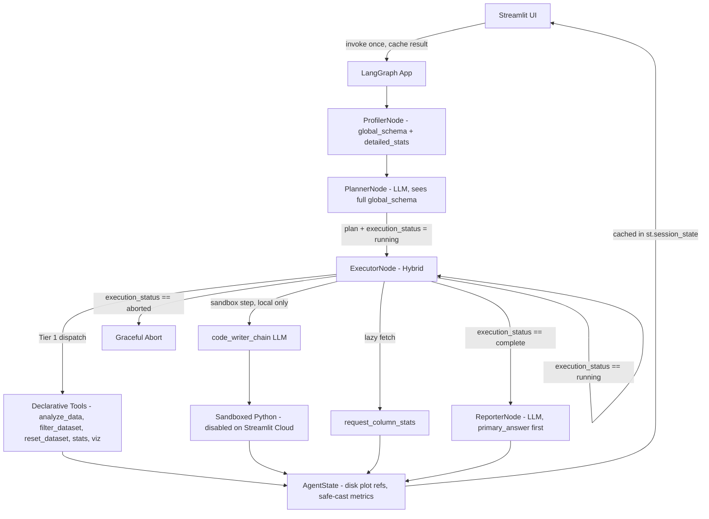

# Architecture Document – scrygent

## 1. High-Level Design

We follow a layered agent architecture with strict dependency direction:

```text
┌──────────────────────────────────────────┐
│              Streamlit UI                │  Thin presentation
│             (app.py)                     │
└─────────────────┬────────────────────────┘
                  │ graph.invoke(state) → cached in st.session_state
                  ▼
┌──────────────────────────────────────────┐
│         LangGraph Agent Graph            │  Orchestration
│        (src/scrygent/graph/builder.py)           │
└───────┬──────────┬───────────┬───────────┘
        │          │           │
        ▼          ▼           ▼
┌───────────┐ ┌──────────┐ ┌──────────────────────────────┐
│ Profiler  │ │ Planner  │ │ Executor Node                │
│ Node      │ │ Node     │ │ ┌──────────────────────────┐ │
│ (determ)  │ │ (LLM)    │ │ │ Hybrid: Deterministic     │ │
└───────────┘ └──────────┘ │ │ Dispatch + LLM Chains     │ │
                           │ └──────────────────────────┘ │
                           └───────────────┬──────────────┘
                                           │
          ┌────────────────────────────────┴────────────────────────┐
          ▼                                                         ▼
   ┌──────────────┐                                         ┌───────────────┐
   │ Tier 1 Tools │                                         │ Sandbox       │
   │ (Declarative)│                                         │ Code Exec.    │
   └──────────────┘                                         │ (Tier 2,      │
                                                            │  local only)  │
                                                            └───────────────┘
```

**Golden Rule:** Higher layers call lower layers. Lower layers never import from upper layers.

---

## 2. Component Responsibilities

### UI Layer (`app.py`)

- Accepts CSV upload and user query.
- Initialises `AgentState` with file path and query.
- Calls `graph.invoke(state)` **once** and caches the entire result in `st.session_state`. On subsequent widget interactions (re-renders), the UI reads from the cache and never re-invokes the graph.
- Reads local file paths from cached state to render dynamic visualization components.
- Displays the `primary_answer` field of the final `AnalysisReport` prominently, then surfaces `additional_insights` below.
- Shows a visible indicator when Tier 2 sandbox was activated during execution.

---

### State & Models (`src/scrygent/models/`)

The models subpackage lives at `src/scrygent/models/` and contains three files: `base_model.py`, `schemas.py`, and `state.py`. A top-level `__init__.py` re-exports everything so import paths remain clean throughout the codebase.

**`base_model.py`** defines `ScrygentBaseModel`, the common base class for every Pydantic model in the system. It applies a `@model_validator(mode="before")` that recursively sanitizes all input data before field validation runs: `np.integer` subclasses → `int`, `np.floating` subclasses → `float`, `np.nan`/`np.inf`/`-np.inf` → `None`, `pd.Timestamp` → ISO-8601 string, nested dicts and lists cleaned recursively. No manual casting is required in tools — any raw Pandas/NumPy value assigned to a model field is sanitized automatically at the model boundary.

**`state.py`** defines `AgentState` (inheriting `ScrygentBaseModel`) — the single source of truth flowing through the graph.

Fields:

| Field | Type | Description |
|---|---|---|
| `original_csv_path` | `Path` | Immutable path to the initial user-uploaded CSV. Never overwritten after initialisation. Allows `reset_dataset` to restore the baseline dataset at any point in a plan. |
| `current_csv_path` | `Path` | Active path consumed by all tools. Updated by wrangling tools (`filter_dataset`, `normalize_column`, etc.) when they write a transformed CSV to disk. |
| `user_query` | `str` | The original natural language query from the user |
| `plan` | `Plan \| None` | The sequential list of steps generated by the Planner. `None` before the Planner runs. |
| `current_step_index` | `int` | Pointer to the active step in the plan |
| `step_outputs` | `dict[str, ToolOutput]` | Accumulated results keyed by `step_id`. `ToolOutput` is `dict[str, JSONType] \| str` where `JSONType` is a recursive type alias covering all JSON-safe primitives. This typing physically prevents Pandas C-types from entering state. |
| `final_report` | `AnalysisReport \| DirectAnswer \| None` | The synthesized output from the Reporter. Type depends on `eval_mode`. `None` until the Reporter runs. |
| `execution_status` | `Literal["pending", "running", "aborted", "complete"]` | Drives all conditional routing. `"pending"` is the initial state before the Planner runs; `"running"` during Executor iteration; `"complete"` or `"aborted"` on exit. |
| `sandbox_activated` | `bool` | Flag surfaced to the UI when Tier 2 execution was used |
| `error_log` | `list[str]` | Non-fatal warnings, Pydantic validation failures, and skipped step records |
| `retry_count` | `int` | Tracks correction loop attempts within the Executor for the current step |
| `data_profile` | `CSVProfile \| None` | Two-level profile: `global_schema` (name + dtype for every column) and `detailed_stats` (full metrics for query-matched + top 15 columns) plus 3-row format sample. `None` before the Profiler runs. |
| `eval_mode` | `bool` | When `True`, Reporter outputs a `DirectAnswer` instead of a full `AnalysisReport`. Default `False`. Set by the caller before `graph.invoke`. |

**`schemas.py`** defines all structured outputs (all inheriting `ScrygentBaseModel`):

- `Plan` — list of `Step` objects
- `Step` — action type, tool name, `parameters` (typed to accept nested lists and dicts, supporting tools like `analyze_data` that take complex filter arrays), `required: bool` flag, `instruction` string, and `reasoning` string. The `reasoning` field is a chain-of-thought field the Planner must populate before committing to a tool name and parameters — it forces the LLM to articulate its analytical intent before generating the tool call.
- `CSVProfile` — two-level profile: `global_schema` (name + dtype for every column) and `detailed_stats` (full metrics for a subset), plus 3-row format sample and a `truncated: bool` flag. When `truncated` is `True`, the Planner knows it is seeing a partial statistical profile and can schedule `request_column_stats` steps for columns absent from `detailed_stats`. All fields are sanitized automatically by `ScrygentBaseModel`'s recursive validator before entering state.
- `AnalysisReport` — `primary_answer` (required string directly answering the user query), `additional_insights` (optional list of secondary observations), and file paths to saved visualizations. The Reporter is strictly prompted to populate `primary_answer` before generating any secondary content.
- `PlotMetadata` — file path and visualization description
- `DirectAnswer` — a single string field holding the extracted answer value for eval mode; format matches benchmark evaluation harness expectations (scalar, string, boolean, or comma-separated list). This is the *only* output in eval mode — no narrative, no plots.

---

### Tools Layer (`src/scrygent/tools/`)

Pure, deterministic functions. They:

- Are stateless (depend only on their inputs).
- Return structured `dict`/`list` objects, never DataFrames.
- Have all mathematical logic validated by unit tests.
- Use `asteval`/`numexpr` in the `arithmetic` tool — no hand-rolled `eval()`.
- Save plots to disk in `visualization.py` and return file paths, not base64 blobs.
- Return raw values freely — JSON sanitization is handled automatically by `ScrygentBaseModel`'s recursive validator at the model boundary, not inside individual tool functions.

> **Design note on wrangling tools:** Functions in `wrangling.py` that produce a transformed dataset write a new temporary CSV to disk and return its path. The Executor updates `current_csv_path` in state to point to the transformed file; `original_csv_path` is never overwritten. Subsequent tools read from `current_csv_path`. `reset_dataset` reverts `current_csv_path` back to `original_csv_path`, allowing the Planner to compare multiple filtered subsets within a single plan without losing access to the baseline data.

---

### Sandbox Layer (`src/scrygent/sandbox/`)

A single, heavily guarded `execute_python` function.

- Isolated from the rest of the system.
- Invoked only when a step type is `"sandbox"` and the `DISABLE_SANDBOX` environment variable is **not** set.
- **Disabled on the public Streamlit Cloud deployment.** The Streamlit Cloud environment variable `DISABLE_SANDBOX=true` is set in the dashboard. This is a hard security requirement: local `exec`-based sandboxes are escapable in shared cloud environments and could expose `GROQ_API_KEY` and other secrets. The UI displays a notice when a query would have required the sandbox.
- Active only during local benchmarking and development (`DISABLE_SANDBOX` unset).
- Code generation is handled just-in-time by the executor, not at planning time.

---

### Agent Nodes (`src/scrygent/agents/`)

#### `profiler_node.py` — Deterministic, First Node

- No LLM call.
- Loads the CSV and computes a two-level structural profile:
  - **`global_schema`:** name and dtype for every column, always complete regardless of CSV width.
  - **`detailed_stats`:** full statistical metrics for columns matched by strict whole-word regex against the user query (pattern: `(?<!\w)<column_name>(?!\w)`) plus the top 15 columns by completeness.
- Extracts a 3-row sample for format context (NaN cells replaced with `None` via `.where(pd.notna(df), None)` before serialisation).
- Stores the `CSVProfile` in state; raw Pandas metrics are sanitized automatically by `ScrygentBaseModel`'s recursive validator on assignment.

#### `planner_node.py`

- **Input:** user query, `data_profile` (both `global_schema` and `detailed_stats`).
- **LLM call:** Groq with `.with_structured_output()` producing a `Plan` (Pydantic model). The Planner sees the full `global_schema` and can include a `request_column_stats` step to fetch detailed metrics for any column not already in `detailed_stats`. Sandbox steps contain a natural-language instruction only — never executable code.
- **Output:** updates state with the plan, sets `execution_status` to `"running"`, resets `current_step_index` to 0.

#### `executor_node.py` — Hybrid Node

The Executor is a **hybrid node**: it dispatches deterministic Tier 1 tool calls and also runs LLM chains internally. It is not a purely deterministic dispatcher.

- **Input:** current state; pops the step at `current_step_index`.
- **Tool step:** dispatches to the registered function in `tools/`. On Pydantic validation failure, an internal `correction_chain` (LLM prompt) runs a localised correction using the bad parameters, target schema, and Pydantic error details — max 2 retries. This is a Python-level loop inside the node function, not a LangGraph graph edge.
- **Sandbox step (local only):** invokes `code_writer_chain` (LLM prompt) to generate Python based on the current state and step instruction, then passes the generated code with a read-only DataFrame copy to `execute_python`. If `DISABLE_SANDBOX=true`, logs a warning to `error_log` and skips the step (treating it as `required: False`).
- **Plan breaker:** if a `required: True` step exhausts retries, sets `execution_status` to `"aborted"` and returns.
- **Output:** increments `current_step_index`. Sets `execution_status` to `"complete"` when all steps finish.

#### `reporter_node.py` — Required Node

- **Input:** all step outputs, data profile, original query, `eval_mode` flag.
- **LLM call:** synthesizes execution results into the appropriate output type.
- **Report mode (`eval_mode = False`):** produces a full `AnalysisReport`. The Pydantic schema forces the LLM to populate `primary_answer` first (directly answering the user query), then optionally populate `additional_insights`. This prevents the LLM from burying the main answer in narrative prose.
- **Eval mode (`eval_mode = True`):** produces a `DirectAnswer` — only the specific answer value, nothing else. No narrative. No plots.
- **Directive:** in both modes, all numerical figures must be based on verified tool outputs provided in context. No Explorer Node or proactive anomaly search — the Reporter answers the query, then surfaces secondary observations only if the tool outputs already contain them.

---

### Graph Builder (`src/scrygent/graph/builder.py`)

- Creates a `StateGraph` with nodes: `profiler`, `planner`, `executor`, `reporter`.
- Entry point: `profiler`.
- No checkpointer (`MemorySaver` or otherwise) — scrygent is a single-pass fire-and-forget engine. State persistence across UI rerenders is handled by `st.session_state` caching in `app.py`.

| Edge | Condition | Destination |
|---|---|---|
| `profiler` → | always | `planner` |
| `planner` → | always | `executor` |
| `executor` → | `execution_status == "running"` | `executor` (step iteration loop) |
| `executor` → | `execution_status == "complete"` | `reporter` |
| `executor` → | `execution_status == "aborted"` | terminal abort state |
| `reporter` → | always | `END` |

- Uses Pydantic state schema with `validate=True`.

---

## 3. Execution Flow

```text
START
  │
  ▼
ProfilerNode ── (deterministic: builds global_schema + detailed_stats)
  │
  ▼
PlannerNode ─── (LLM sees global_schema + detailed_stats; generates Plan)
  │
  ▼
ExecutorNode ◄──────────────────────────────────────────────── (loop)
  │   │
  │   ├── Tool step:    Tier 1 dispatch → result stored
  │   ├── Lazy fetch:   request_column_stats → additional column detail stored
  │   └── Sandbox step: code_writer_chain (LLM) → sandbox exec → result stored
  │                     (skipped if DISABLE_SANDBOX=true)
  │
  ├── (execution_status == "aborted") ──► Graceful Abort / Surface Error
  │
  ▼  (execution_status == "complete")
ReporterNode ── (LLM: primary_answer first, then additional_insights)
  │
  ▼
END → result cached in st.session_state
```

---

## 4. Security & Data Integrity

| Concern | Mitigation |
|---|---|
| Bulk data in prompts | Only `global_schema`, truncated `detailed_stats`, 3-row sample, and tool outputs enter LLM context |
| Arithmetic code injection | `asteval`/`numexpr` used exclusively; no native `eval()` |
| Sandbox escape on public deployment | Tier 2 fully disabled via `DISABLE_SANDBOX=true` in Streamlit Cloud. Locally: no network, no file access, 5-second timeout, module whitelist |
| Blind code generation | Sandbox code generated just-in-time with current state via `code_writer_chain` |
| State memory bloat | Plots saved to disk; only file paths stored in `AgentState` |
| Graph crashes from bad LLM output | Pydantic validation with internal `correction_chain` loops |
| JSON serialization errors | `ScrygentBaseModel`'s recursive `@model_validator` converts all Pandas/NumPy types on assignment; `.where(pd.notna(df), None)` applied to row samples before dict serialization |
| Buried answer in narrative | `primary_answer` isolated in a dedicated Pydantic field; Reporter is prompted to fill it before any secondary content |

---

## 5. Testing & Quality

| Layer | Method |
|---|---|
| Unit tests | Pure functions with known DataFrames; fast, run in CI |
| JSON safety tests | Verify `ScrygentBaseModel._recursive_sanitize` converts `np.int64` → `int`, `np.nan`/`np.inf` → `None`, `pd.Timestamp` → ISO-8601 string, and cleans nested structures |
| Node tests | Planner, executor, reporter tested with mocked LLM responses |
| Routing tests | Conditional router tested for all four `execution_status` values: `"pending"`, `"running"`, `"aborted"`, `"complete"` |
| Integration tests | Full graph run with a sample CSV; assert `primary_answer` is populated, `AnalysisReport` structure is valid |
| Security tests | Verify `execute_python` rejects forbidden imports and enforces timeout; verify `DISABLE_SANDBOX=true` causes sandbox steps to be skipped cleanly |

CI runs on every push via `uv run pytest`.

---

## 6. Deployment

- **Streamlit Cloud** reads `pyproject.toml` and installs via `pip`. The `uv.lock` file is used for local development only.
- **Pandas 3.x is required.** The tool suite and profiler depend on Pandas 3.x strict C-type array behavior. Running on Pandas 2.x or 1.x will cause silent type-inference differences in `profiler.py` and may allow data-poisoning robustness tests to pass incorrectly. Pin `pandas>=3.0` in `pyproject.toml`.
- **Secrets:** `GROQ_API_KEY` set in the Streamlit dashboard. `DISABLE_SANDBOX=true` also set in the dashboard.
- **State persistence:** `app.py` caches the entire `graph.invoke` result in `st.session_state` after each run. Subsequent Streamlit rerenders read from the cache. No `MemorySaver` or LangGraph checkpointer is used.
- **Plot persistence:** Plot file paths within the cached `AgentState` remain valid for the duration of the Streamlit container session.
- **Cleanup:** Temporary plot files and any intermediate CSVs written by wrangling tools are cleaned by Streamlit's container session lifecycle.

---

## 7. Extensibility

| Goal | How |
|---|---|
| Add a new query operation | Extend `analyze_data` parameter schema and its internal dispatch logic |
| Add a new statistical tool | Add function to `tools/statistics.py`, register in executor dispatch dict |
| Add a new plot type | Extend `visualization.generate_plot` |
| Enable sandbox in production | Replace local `exec` with a Docker-based executor in `src/scrygent/sandbox/executor.py` only; remove `DISABLE_SANDBOX` flag |
| Add columns to lazy fetch | Planner adds a `request_column_stats` step; no node changes needed |

---

## 8. Multi-Step Composition Pattern

The Plan-and-Execute architecture natively handles complex analytical questions that appear to require a single combined operation by decomposing them into a multi-step plan. No Tier 2 sandbox escalation is needed for these cases.

**Example: Filter then Correlate**

A question like "what is the correlation between salary and tenure for employees in the Engineering department?" is handled entirely by Tier 1:

1. The Planner generates a `filter_dataset` step: filter rows where `department == "Engineering"` and write the result to a temporary CSV, updating `current_csv_path`.
2. The Planner generates a `correlation` step: compute correlation between `salary` and `tenure`. The Executor reads from `current_csv_path`, which now points to the filtered subset.

The state update from step 1 is the mechanism. No tool needs to return a DataFrame, no cross-tool data passing occurs, and the stateless-tools rule holds. The sequential nature of the Plan-and-Execute loop means each step naturally inherits the side effects of the previous one through `current_csv_path`.

**Example: Compare pre- and post-transformation values**

If a plan requires statistics on both the original and a filtered subset:

1. Schedule all tool calls that need the original dataset first (e.g., a `correlation` step on the full data).
2. Then schedule the `filter_dataset` step, which updates `current_csv_path`.
3. All subsequent steps operate on the filtered subset.
4. If the Planner needs to revert to the original at any later point, it schedules a `reset_dataset` step, which sets `current_csv_path` back to `original_csv_path`.

**Why this removes the need for Tier 2 on these cases**

The previous documented limitation assumed a single tool had to do everything. With `filter_dataset`, `reset_dataset`, and `current_csv_path` / `original_csv_path` in state, the Planner has full control over which dataset each step sees. The LLM is not writing code — it is writing a plan, which is exactly the role it is designed for.

---

## 9. Formal Evaluation

scrygent is evaluated against two published benchmarks.

**Primary: InfiAgent-DABench (ICML 2024)**

603 data analysis questions derived from 124 CSV files. Designed specifically for agents that answer questions by interacting with a code execution environment. GPT-4 achieves 78.99% accuracy and is the SOTA baseline. Dataset and evaluation toolkit available at `github.com/InfiAgent/InfiAgent`. Total size is under 100MB and runs locally. Store in the Git-ignored `data/dabench/` directory — do not commit to the repository.

**Secondary: DataBench Lite (SemEval 2025 Task 8)**

80 real-world datasets with 1,822 questions, capped at 20 rows per dataset. Available on HuggingFace at `cardiffnlp/databench` and downloads automatically via the `datasets` library. Store downloaded files in `data/databench_lite/`.

**Evaluation procedure**

Set `eval_mode = True` in `AgentState` before calling `graph.invoke`. The Reporter outputs a `DirectAnswer` for each question. Compare against the gold-standard answer using the benchmark's provided evaluation harness. Run evaluation with at minimum two model backbones: Llama 3.3 70B via Groq (free tier) and one premium model via API access. Report both scores against the 78.99% GPT-4 DABench baseline.

**Expected accuracy range**

Llama 3.3 70B backbone: 65–73%. Premium backbone (GPT-4o or Claude 3.5): competitive with or marginally above the 78.99% baseline on standard statistical questions where Tier 1 tools guarantee correct computation.

**Robustness test data**

Generate poisoned variants from clean benchmark CSVs to evaluate error handling: files saved in UTF-16 or cp1252 encoding, files using semicolons or pipes as delimiters, files where data starts on row 5 or headers are missing, and files where a numeric column contains string artifacts mixed with valid numbers.


