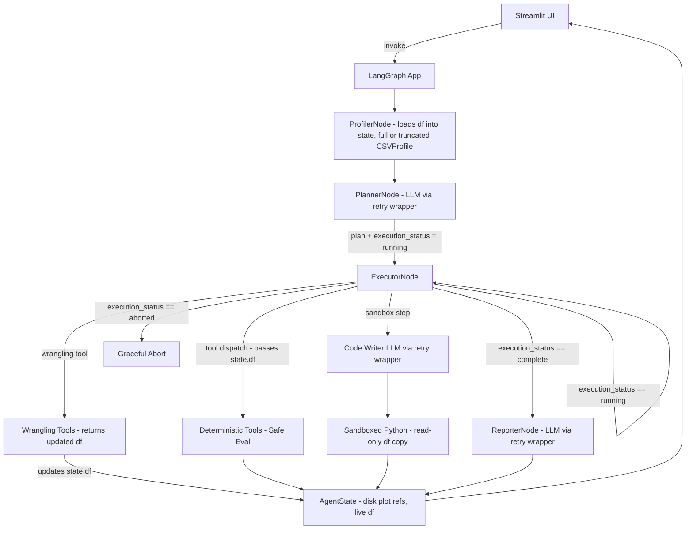

# Architecture Document – scrygent

## 1. High-Level Design

We follow a layered agent architecture with strict dependency direction:

```text
┌──────────────────────────────────────────┐
│              Streamlit UI                │  Thin presentation
│             (app.py)                     │
└─────────────────┬────────────────────────┘
                  │ graph.invoke(state)
                  ▼
┌──────────────────────────────────────────┐
│         LangGraph Agent Graph            │  Orchestration
│        (src/graph/builder.py)            │
└───────┬──────────┬───────────┬───────────┘
        │          │           │
        ▼          ▼           ▼
┌───────────┐ ┌──────────┐ ┌──────────────────────────────┐
│ Profiler  │ │ Planner  │ │ Executor Node                │
│ Node      │ │ Node     │ │ ┌──────────────────────────┐ │
│ (determ)  │ │ (LLM)    │ │ │ Internal Correction Loop │ │
└───────────┘ └──────────┘ │ └──────────────────────────┘ │
                           └───────────────┬──────────────┘
                                           │
          ┌────────────────────────────────┴────────────────────────┐
          ▼                                                         ▼
   ┌──────────────┐                                         ┌───────────────┐
   │ Deterministic│                                         │ Sandbox       │
   │ Tools (Tier1)│                                         │ Code Exec.    │
   └──────────────┘                                         │ (Tier 2)      │
                                                            └───────────────┘
```

**Golden Rule:** Higher layers call lower layers. Lower layers never import from upper layers.

---

## 2. Component Responsibilities

### UI Layer (`app.py`)

- Accepts CSV upload and user query.
- Initialises `AgentState` with file path and query.
- Calls `graph.invoke(state)`.
- Mirrors plot paths to `st.session_state` to survive Streamlit UI rerenders.
- Reads local file paths provided by state to render dynamic visualization components.
- Displays the final `AnalysisReport` markdown payload generated by the downstream nodes.

---

### State & Models (`src/state.py`, `src/models.py`)

**`state.py`** defines `AgentState` as a Pydantic `BaseModel` — the single source of truth flowing through the graph.

Fields:

| Field | Type | Description |
|---|---|---|
| `csv_path` | `str` | Path to the uploaded CSV file |
| `user_query` | `str` | The natural language query from the user |
| `df` | `Any` | The live working DataFrame. Loaded by the Profiler and updated in-place by wrangling steps. Excluded from Pydantic serialization via `model_config` with `arbitrary_types_allowed=True`. Never serialized to disk; scoped to the session. |
| `plan` | `Plan` | The list of steps generated by the Planner |
| `current_step_index` | `int` | Pointer to the active step in the plan |
| `step_outputs` | `dict` | Accumulated results from completed steps |
| `final_report` | `AnalysisReport` | The synthesized output from the Reporter |
| `execution_status` | `Literal["running", "aborted", "complete"]` | Drives all conditional routing decisions |
| `sandbox_activated` | `bool` | Flag surfaced to the UI when Tier 2 is used |
| `error_log` | `list[str]` | Non-fatal warnings and skipped step records |
| `retry_count` | `int` | Tracks correction attempts within the executor |
| `data_profile` | `CSVProfile` | Optimized structural summary from the Profiler |

**`models.py`** defines all structured outputs:

- `Plan` — list of `Step` objects
- `Step` — action type, tool name, parameters, `required: bool` flag, instruction string
- `CSVProfile` — column-optimized statistics metadata plus 3-row format sample
- `AnalysisReport` — summary, insights, file paths to saved visualizations
- `PlotMetadata` — file path and visualization description

---

### Tools Layer (`src/tools/`)

Pure, deterministic functions. They:

- Are stateless (depend only on their inputs).
- Return structured `dict`/`list` objects, never DataFrames — **with one exception:** wrangling tools (`fill_missing`, `normalize_column`, `create_derived_column`, `filter_rows`, etc.) return a `(DataFrame, summary_dict)` tuple. The executor updates `state.df` with the new DataFrame and stores the summary dict in `step_outputs`. All other tools receive `state.df` as input and return only a dict.
- Have all mathematical logic validated by unit tests.
- Use `asteval`/`numexpr` in the `arithmetic` tool — no hand-rolled `eval()`.
- Save plots to disk in `visualization.py` and return file paths, not base64 blobs.

---

### Sandbox Layer (`src/sandbox/`)

A single, heavily guarded `execute_python` function.

- Isolated from the rest of the system.
- Invoked only when an executor step type is `"sandbox"`.
- Code generation is handled just-in-time by the executor, not at planning time.

---

### Agent Nodes (`src/agents/`)

#### `profiler_node.py` — Deterministic, First Node

- No LLM call.
- Loads the CSV via `load_csv` and stores the DataFrame as `state.df`.
- Computes structural metadata via `profile_dataframe`.
- Applies a token count check before building the profile payload. If the full profile for all columns fits within a safe threshold, it sends complete statistics for every column. If the full profile exceeds the threshold, it falls back to intelligent truncation: full statistical details for columns named in the query plus the top 15 columns by completeness. In both cases it **always includes the name and dtype of every column**, so the Planner can reference any column by name regardless of whether its detailed stats were included.
- Extracts a 3-row sample for format context.
- Stores the optimized `CSVProfile` in state.

#### `planner_node.py`

- **Input:** user query, optimized `data_profile`.
- **LLM call:** Groq with `.with_structured_output()` producing a `Plan` (Pydantic model). Sandbox steps contain a natural-language instruction only — never executable code.
- **Output:** updates state with the plan, sets `execution_status` to `"running"`, resets `current_step_index` to 0.

#### `executor_node.py`

- **Input:** current state; pops the step at `current_step_index`.
- **Tool step:** dispatches to the registered function in `tools/`, passing `state.df` as the working DataFrame. All calls are wrapped in a broad `try...except Exception` block. Both Pydantic `ValidationError` and any runtime error (`KeyError`, `ValueError`, etc.) are caught, converted to a string, and passed to the internal `correction_chain`. On success, if the tool is a wrangling tool, the executor updates `state.df` with the returned DataFrame before storing the summary dict. The correction chain runs a localised LLM correction prompt (max 2 retries). This is a Python-level loop inside the node function — not a LangGraph graph edge.
- **Sandbox step:** invokes `code_writer_chain` to generate Python, passes it with a read-only copy of `state.df` to `execute_python`, stores the string output. If the returned string resembles a Python traceback, the executor logs it to `error_log` and treats the step as failed rather than storing garbage as a result.
- **Plan breaker:** if a `required: True` step exhausts retries, sets `execution_status` to `"aborted"` and returns. The conditional router handles the exit.
- **Output:** increments `current_step_index`. Sets `execution_status` to `"complete"` when all steps finish successfully.

#### `reporter_node.py` — Required Node

- **Input:** all step outputs, data profile, original query.
- **LLM call:** synthesizes execution results into a final `AnalysisReport` (Pydantic model).
- **Directive:** strictly prompted to base all numerical figures on the verified tool outputs provided in context. Its prompt explicitly instructs: if any step output resembles a Python traceback or error string, treat that step as failed, omit its output from all reported numbers, and advise the user to rephrase the relevant part of their query. No post-hoc programmatic validation is applied.

---

### Graph Builder (`src/graph/builder.py`)

- Creates a `StateGraph` with nodes: `profiler`, `planner`, `executor`, `reporter`.
- Entry point: `profiler`.

| Edge | Condition | Destination |
|---|---|---|
| `profiler` → | always | `planner` |
| `planner` → | always | `executor` |
| `executor` → | `execution_status == "running"` | `executor` (step iteration loop) |
| `executor` → | `execution_status == "complete"` | `reporter` |
| `executor` → | `execution_status == "aborted"` | terminal abort state |
| `reporter` → | always | `END` |

- Uses Pydantic state schema with `validate=True`.

---

## 3. Execution Flow

```text
START
  │
  ▼
ProfilerNode ── (deterministic, builds CSVProfile — full stats or truncated based on token count)
  │
  ▼
PlannerNode ─── (LLM generates Plan, sets execution_status = "running")
  │
  ▼
ExecutorNode ◄──────────────────────────────────────────────── (loop)
  │   │
  │   ├── Tool step:    dispatch → result stored
  │   └── Sandbox step: code_writer LLM → sandbox exec → result stored
  │
  ├── (execution_status == "aborted") ──► Graceful Abort / Surface Error
  │
  ▼  (execution_status == "complete")
ReporterNode ── (LLM synthesizes final AnalysisReport)
  │
  ▼
END
```

---

## 4. Security & Data Integrity

| Concern | Mitigation |
|---|---|
| Bulk data in prompts | Only truncated profile summaries, 3-row samples, and tool outputs enter LLM context |
| Arithmetic code injection | `asteval`/`numexpr` used exclusively; no native `eval()` |
| Sandbox escape | No network, no file access, 5-second timeout, module whitelist |
| Blind code generation | Sandbox code is generated just-in-time with the most recent state |
| State memory bloat | Plots saved to disk; only file paths stored in `AgentState`. DataFrame held in-memory as `state.df` within the session only |
| Graph crashes from bad LLM output | Pydantic validation with internal correction loops |
| Runtime tool errors bypassing recovery | Broad `try...except Exception` in executor; all exceptions route through correction chain |
| Sandbox traceback interpreted as result | Executor checks output string before storing; Reporter prompt explicitly handles traceback text |
| Transient LLM API failures | Shared retry wrapper in `src/utils/llm.py` with exponential backoff (3 attempts) for `RateLimitError` and `APIConnectionError` |

---

## 5. Testing & Quality

| Layer | Method |
|---|---|
| Tool tests | Pure functions with known DataFrames; fast, run in CI |
| Node tests | Planner, executor, reporter tested with mocked LLM responses |
| Routing tests | Conditional router tested for all three `execution_status` values |
| Integration tests | Full graph run with a sample CSV; assert final report structure |
| Security tests | Verify `execute_python` rejects forbidden imports and enforces timeout |
| Retry tests | Verify retry wrapper fires on `RateLimitError` and `APIConnectionError`, surfaces clean error after exhausting retries |

CI runs on every push via `uv run pytest`.

---

## 6. Deployment

- **Streamlit Cloud** reads `pyproject.toml` and installs via `pip`. The `uv.lock` file is used for local development only.
- **Secrets:** `GROQ_API_KEY` set in the Streamlit dashboard.
- **Plot persistence:** `app.py` mirrors all plot file paths from `AgentState` into `st.session_state` so visualizations survive Streamlit UI rerenders within the same session.
- **Cleanup:** Temporary plot files are cleaned by Streamlit's container session lifecycle.

---

## 7. Extensibility

| Goal | How |
|---|---|
| Add a new statistical tool | Add function to `tools/`, register in executor dispatch dict |
| Add a new plot type | Extend `visualization.generate_plot` |
| Harden the sandbox | Swap local `exec` with a Docker-based executor in `src/sandbox/executor.py` only |
| Enable Gemini fallback | Verify Pydantic schema compatibility with Gemini's structured output, then extend `src/utils/llm.py` retry wrapper to swap provider after exhausting Groq retries |

---

## 8. Mermaid Diagram


