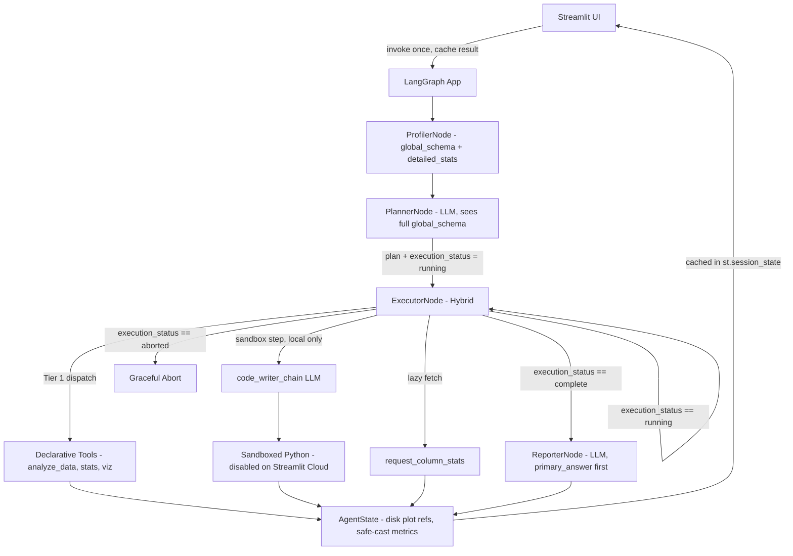

# Architecture Document – scrygent

## 1. High-Level Design

We follow a layered agent architecture with strict dependency direction:

```text
┌──────────────────────────────────────────┐
│              Streamlit UI                │  Thin presentation
│             (app.py)                     │
└─────────────────┬────────────────────────┘
                  │ graph.invoke(state) → cached in st.session_state
                  ▼
┌──────────────────────────────────────────┐
│         LangGraph Agent Graph            │  Orchestration
│        (src/graph/builder.py)            │
└───────┬──────────┬───────────┬───────────┘
        │          │           │
        ▼          ▼           ▼
┌───────────┐ ┌──────────┐ ┌──────────────────────────────┐
│ Profiler  │ │ Planner  │ │ Executor Node                │
│ Node      │ │ Node     │ │ ┌──────────────────────────┐ │
│ (determ)  │ │ (LLM)    │ │ │ Hybrid: Deterministic     │ │
└───────────┘ └──────────┘ │ │ Dispatch + LLM Chains     │ │
                           │ └──────────────────────────┘ │
                           └───────────────┬──────────────┘
                                           │
          ┌────────────────────────────────┴────────────────────────┐
          ▼                                                         ▼
   ┌──────────────┐                                         ┌───────────────┐
   │ Tier 1 Tools │                                         │ Sandbox       │
   │ (Declarative)│                                         │ Code Exec.    │
   └──────────────┘                                         │ (Tier 2,      │
                                                            │  local only)  │
                                                            └───────────────┘
```

**Golden Rule:** Higher layers call lower layers. Lower layers never import from upper layers.

---

## 2. Component Responsibilities

### UI Layer (`app.py`)

- Accepts CSV upload and user query.
- Initialises `AgentState` with file path and query.
- Calls `graph.invoke(state)` **once** and caches the entire result in `st.session_state`. On subsequent widget interactions (re-renders), the UI reads from the cache and never re-invokes the graph.
- Reads local file paths from cached state to render dynamic visualization components.
- Displays the `primary_answer` field of the final `AnalysisReport` prominently, then surfaces `additional_insights` below.
- Shows a visible indicator when Tier 2 sandbox was activated during execution.

---

### State & Models (`src/state.py`, `src/models.py`)

**`state.py`** defines `AgentState` as a Pydantic `BaseModel` — the single source of truth flowing through the graph.

Fields:

| Field | Type | Description |
|---|---|---|
| `csv_path` | `str` | Path to the uploaded CSV file |
| `user_query` | `str` | The natural language query from the user |
| `plan` | `Plan` | The list of steps generated by the Planner |
| `current_step_index` | `int` | Pointer to the active step in the plan |
| `step_outputs` | `dict` | Accumulated results from completed steps |
| `final_report` | `AnalysisReport` | The synthesized output from the Reporter |
| `execution_status` | `Literal["running", "aborted", "complete"]` | Drives all conditional routing decisions |
| `sandbox_activated` | `bool` | Flag surfaced to the UI when Tier 2 is used |
| `error_log` | `list[str]` | Non-fatal warnings and skipped step records |
| `retry_count` | `int` | Tracks correction attempts within the executor |
| `data_profile` | `CSVProfile` | Structured profile with `global_schema` (all columns + dtypes) and `detailed_stats` (full metrics for query-matched + top 15 columns), plus a 3-row format sample |
| `eval_mode` | `bool` | When `True`, Reporter outputs a `DirectAnswer` instead of a full `AnalysisReport`. Default `False`. Set by the caller before `graph.invoke`. |

**`models.py`** defines all structured outputs:

- `Plan` — list of `Step` objects
- `Step` — action type, tool name, parameters, `required: bool` flag, instruction string
- `CSVProfile` — two-level profile: `global_schema` (name + dtype for every column) and `detailed_stats` (full metrics for a subset), plus 3-row format sample. All numeric fields are cast to JSON-safe Python types via `_safe_cast_metric`; no `np.nan`, `np.inf`, or `np.int64` types enter state.
- `AnalysisReport` — `primary_answer` (required string directly answering the user query), `additional_insights` (optional list of secondary observations), and file paths to saved visualizations. The Reporter is strictly prompted to populate `primary_answer` before generating any secondary content.
- `PlotMetadata` — file path and visualization description
- `DirectAnswer` — a single string field holding the extracted answer value for eval mode; format matches benchmark evaluation harness expectations (scalar, string, boolean, or comma-separated list). This is the *only* output in eval mode — no narrative, no plots.

---

### Tools Layer (`src/tools/`)

Pure, deterministic functions. They:

- Are stateless (depend only on their inputs).
- Return structured `dict`/`list` objects, never DataFrames.
- Have all mathematical logic validated by unit tests.
- Use `asteval`/`numexpr` in the `arithmetic` tool — no hand-rolled `eval()`.
- Save plots to disk in `visualization.py` and return file paths, not base64 blobs.
- Apply `_safe_cast_metric` to scrub all `np.nan`, `np.inf`, `np.int64`, and other Pandas/NumPy native C-types before returning, ensuring JSON-safe output.

> **Design note on wrangling tools:** Functions in `wrangling.py` (e.g., `fill_missing`, `normalize_column`, `create_derived_column`) that logically produce a transformed dataset do so by writing a new temporary CSV to disk and returning the new path. The executor updates `csv_path` in state to point to the transformed file. Subsequent tools then read from this updated path. This preserves the "tools return structured dicts" rule while allowing data preparation steps to chain cleanly. The original CSV is never modified.

---

### Sandbox Layer (`src/sandbox/`)

A single, heavily guarded `execute_python` function.

- Isolated from the rest of the system.
- Invoked only when a step type is `"sandbox"` and the `DISABLE_SANDBOX` environment variable is **not** set.
- **Disabled on the public Streamlit Cloud deployment.** The Streamlit Cloud environment variable `DISABLE_SANDBOX=true` is set in the dashboard. This is a hard security requirement: local `exec`-based sandboxes are escapable in shared cloud environments and could expose `GROQ_API_KEY` and other secrets. The UI displays a notice when a query would have required the sandbox.
- Active only during local benchmarking and development (`DISABLE_SANDBOX` unset).
- Code generation is handled just-in-time by the executor, not at planning time.

---

### Agent Nodes (`src/agents/`)

#### `profiler_node.py` — Deterministic, First Node

- No LLM call.
- Loads the CSV and computes a two-level structural profile:
  - **`global_schema`:** name and dtype for every column, always complete regardless of CSV width.
  - **`detailed_stats`:** full statistical metrics for columns matched by strict whole-word regex against the user query (pattern: `(?<!\w)<column_name>(?!\w)`) plus the top 15 columns by completeness.
- Extracts a 3-row sample for format context (NaN cells replaced with `None` via `.where(pd.notna(df), None)` before serialisation).
- Stores the `CSVProfile` in state with all values passed through `_safe_cast_metric`.

#### `planner_node.py`

- **Input:** user query, `data_profile` (both `global_schema` and `detailed_stats`).
- **LLM call:** Groq with `.with_structured_output()` producing a `Plan` (Pydantic model). The Planner sees the full `global_schema` and can include a `request_column_stats` step to fetch detailed metrics for any column not already in `detailed_stats`. Sandbox steps contain a natural-language instruction only — never executable code.
- **Output:** updates state with the plan, sets `execution_status` to `"running"`, resets `current_step_index` to 0.

#### `executor_node.py` — Hybrid Node

The Executor is a **hybrid node**: it dispatches deterministic Tier 1 tool calls and also runs LLM chains internally. It is not a purely deterministic dispatcher.

- **Input:** current state; pops the step at `current_step_index`.
- **Tool step:** dispatches to the registered function in `tools/`. On Pydantic validation failure, an internal `correction_chain` (LLM prompt) runs a localised correction using the bad parameters, target schema, and Pydantic error details — max 2 retries. This is a Python-level loop inside the node function, not a LangGraph graph edge.
- **Sandbox step (local only):** invokes `code_writer_chain` (LLM prompt) to generate Python based on the current state and step instruction, then passes the generated code with a read-only DataFrame copy to `execute_python`. If `DISABLE_SANDBOX=true`, logs a warning to `error_log` and skips the step (treating it as `required: False`).
- **Plan breaker:** if a `required: True` step exhausts retries, sets `execution_status` to `"aborted"` and returns.
- **Output:** increments `current_step_index`. Sets `execution_status` to `"complete"` when all steps finish.

#### `reporter_node.py` — Required Node

- **Input:** all step outputs, data profile, original query, `eval_mode` flag.
- **LLM call:** synthesizes execution results into the appropriate output type.
- **Report mode (`eval_mode = False`):** produces a full `AnalysisReport`. The Pydantic schema forces the LLM to populate `primary_answer` first (directly answering the user query), then optionally populate `additional_insights`. This prevents the LLM from burying the main answer in narrative prose.
- **Eval mode (`eval_mode = True`):** produces a `DirectAnswer` — only the specific answer value, nothing else. No narrative. No plots.
- **Directive:** in both modes, all numerical figures must be based on verified tool outputs provided in context. No Explorer Node or proactive anomaly search — the Reporter answers the query, then surfaces secondary observations only if the tool outputs already contain them.

---

### Graph Builder (`src/graph/builder.py`)

- Creates a `StateGraph` with nodes: `profiler`, `planner`, `executor`, `reporter`.
- Entry point: `profiler`.
- No checkpointer (`MemorySaver` or otherwise) — scrygent is a single-pass fire-and-forget engine. State persistence across UI rerenders is handled by `st.session_state` caching in `app.py`.

| Edge | Condition | Destination |
|---|---|---|
| `profiler` → | always | `planner` |
| `planner` → | always | `executor` |
| `executor` → | `execution_status == "running"` | `executor` (step iteration loop) |
| `executor` → | `execution_status == "complete"` | `reporter` |
| `executor` → | `execution_status == "aborted"` | terminal abort state |
| `reporter` → | always | `END` |

- Uses Pydantic state schema with `validate=True`.

---

## 3. Execution Flow

```text
START
  │
  ▼
ProfilerNode ── (deterministic: builds global_schema + detailed_stats)
  │
  ▼
PlannerNode ─── (LLM sees global_schema + detailed_stats; generates Plan)
  │
  ▼
ExecutorNode ◄──────────────────────────────────────────────── (loop)
  │   │
  │   ├── Tool step:    Tier 1 dispatch → result stored
  │   ├── Lazy fetch:   request_column_stats → additional column detail stored
  │   └── Sandbox step: code_writer_chain (LLM) → sandbox exec → result stored
  │                     (skipped if DISABLE_SANDBOX=true)
  │
  ├── (execution_status == "aborted") ──► Graceful Abort / Surface Error
  │
  ▼  (execution_status == "complete")
ReporterNode ── (LLM: primary_answer first, then additional_insights)
  │
  ▼
END → result cached in st.session_state
```

---

## 4. Security & Data Integrity

| Concern | Mitigation |
|---|---|
| Bulk data in prompts | Only `global_schema`, truncated `detailed_stats`, 3-row sample, and tool outputs enter LLM context |
| Arithmetic code injection | `asteval`/`numexpr` used exclusively; no native `eval()` |
| Sandbox escape on public deployment | Tier 2 fully disabled via `DISABLE_SANDBOX=true` in Streamlit Cloud. Locally: no network, no file access, 5-second timeout, module whitelist |
| Blind code generation | Sandbox code generated just-in-time with current state via `code_writer_chain` |
| State memory bloat | Plots saved to disk; only file paths stored in `AgentState` |
| Graph crashes from bad LLM output | Pydantic validation with internal `correction_chain` loops |
| JSON serialization errors | `_safe_cast_metric` scrubs `np.nan`, `np.inf`, `np.int64` from all tool outputs before they enter state; `.where(pd.notna(df), None)` applied to row samples |
| Buried answer in narrative | `primary_answer` isolated in a dedicated Pydantic field; Reporter is prompted to fill it before any secondary content |

---

## 5. Testing & Quality

| Layer | Method |
|---|---|
| Unit tests | Pure functions with known DataFrames; fast, run in CI |
| JSON safety tests | Verify `_safe_cast_metric` converts `np.nan` → `None`, `np.inf` → `None`, `np.int64` → `int` |
| Node tests | Planner, executor, reporter tested with mocked LLM responses |
| Routing tests | Conditional router tested for all three `execution_status` values |
| Integration tests | Full graph run with a sample CSV; assert `primary_answer` is populated, `AnalysisReport` structure is valid |
| Security tests | Verify `execute_python` rejects forbidden imports and enforces timeout; verify `DISABLE_SANDBOX=true` causes sandbox steps to be skipped cleanly |

CI runs on every push via `uv run pytest`.

---

## 6. Deployment

- **Streamlit Cloud** reads `pyproject.toml` and installs via `pip`. The `uv.lock` file is used for local development only.
- **Pandas 3.x is required.** The tool suite and profiler depend on Pandas 3.x strict C-type array behavior. Running on Pandas 2.x or 1.x will cause silent type-inference differences in `profiler.py` and may allow data-poisoning robustness tests to pass incorrectly. Pin `pandas>=3.0` in `pyproject.toml`.
- **Secrets:** `GROQ_API_KEY` set in the Streamlit dashboard. `DISABLE_SANDBOX=true` also set in the dashboard.
- **State persistence:** `app.py` caches the entire `graph.invoke` result in `st.session_state` after each run. Subsequent Streamlit rerenders read from the cache. No `MemorySaver` or LangGraph checkpointer is used.
- **Plot persistence:** Plot file paths within the cached `AgentState` remain valid for the duration of the Streamlit container session.
- **Cleanup:** Temporary plot files and any intermediate CSVs written by wrangling tools are cleaned by Streamlit's container session lifecycle.

---

## 7. Extensibility

| Goal | How |
|---|---|
| Add a new query operation | Extend `analyze_data` parameter schema and its internal dispatch logic |
| Add a new statistical tool | Add function to `tools/statistics.py`, register in executor dispatch dict |
| Add a new plot type | Extend `visualization.generate_plot` |
| Enable sandbox in production | Replace local `exec` with a Docker-based executor in `src/sandbox/executor.py` only; remove `DISABLE_SANDBOX` flag |
| Add columns to lazy fetch | Planner adds a `request_column_stats` step; no node changes needed |

---

## 8. Known Limitations

- **Filter + correlate across tools:** `analyze_data` handles filter/aggregate/sort internally and returns a scalar or dict. If a question requires filtering rows and then computing a cross-column correlation on the filtered subset, no single Tier 1 tool covers this. The Planner must route this to Tier 2 (sandbox). On the public deployment where the sandbox is disabled, such queries will fail gracefully with a clear error message.

- **Wrangling + downstream Tier 1 chaining:** Wrangling steps that produce a transformed CSV update `csv_path` in state. All subsequent Tier 1 tool calls read from the updated path. This is correct but means the original CSV is no longer accessible after a wrangling step modifies it. If a plan needs to compare pre- and post-transformation values, the Planner must schedule the pre-transformation tool calls first.

---

## 9. Formal Evaluation

scrygent is evaluated against two published benchmarks.

**Primary: InfiAgent-DABench (ICML 2024)**

603 data analysis questions derived from 124 CSV files. Designed specifically for agents that answer questions by interacting with a code execution environment. GPT-4 achieves 78.99% accuracy and is the SOTA baseline. Dataset and evaluation toolkit available at `github.com/InfiAgent/InfiAgent`. Total size is under 100MB and runs locally. Store in the Git-ignored `data/dabench/` directory — do not commit to the repository.

**Secondary: DataBench Lite (SemEval 2025 Task 8)**

80 real-world datasets with 1,822 questions, capped at 20 rows per dataset. Available on HuggingFace at `cardiffnlp/databench` and downloads automatically via the `datasets` library. Store downloaded files in `data/databench_lite/`.

**Evaluation procedure**

Set `eval_mode = True` in `AgentState` before calling `graph.invoke`. The Reporter outputs a `DirectAnswer` for each question. Compare against the gold-standard answer using the benchmark's provided evaluation harness. Run evaluation with at minimum two model backbones: Llama 3.3 70B via Groq (free tier) and one premium model via API access. Report both scores against the 78.99% GPT-4 DABench baseline.

**Expected accuracy range**

Llama 3.3 70B backbone: 65–73%. Premium backbone (GPT-4o or Claude 3.5): competitive with or marginally above the 78.99% baseline on standard statistical questions where Tier 1 tools guarantee correct computation.

**Robustness test data**

Generate poisoned variants from clean benchmark CSVs to evaluate error handling: files saved in UTF-16 or cp1252 encoding, files using semicolons or pipes as delimiters, files where data starts on row 5 or headers are missing, and files where a numeric column contains string artifacts mixed with valid numbers.


