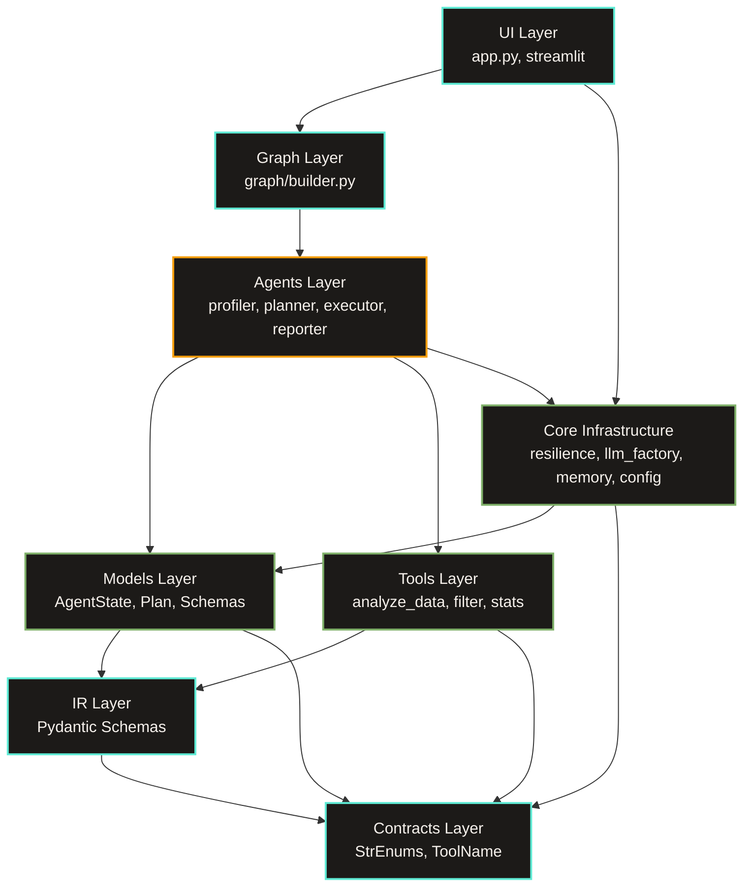
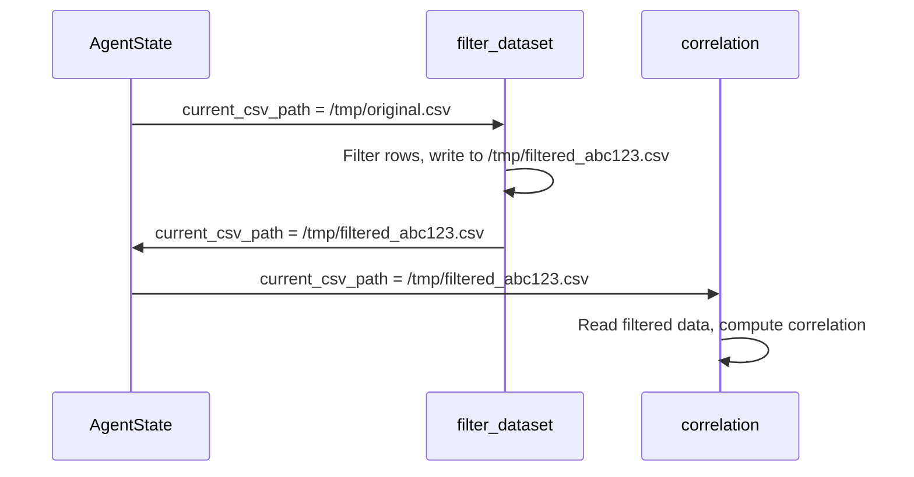
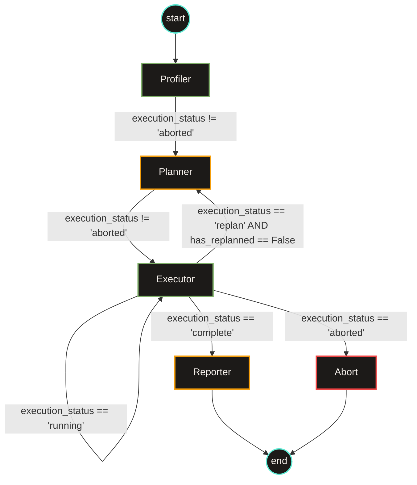

# Scrygent Architecture Document

**Version:** 1.2  
**Last Updated:** July 2026  

This document defines the structural constraints, data flow, and engineering decisions of the Scrygent deterministic compiler engine. It is the canonical reference for understanding how the system maintains mathematical determinism in a non-deterministic LLM environment.

---

## Table of Contents

1. [Executive Summary](#executive-summary)
2. [The Dependency Golden Rule](#the-dependency-golden-rule)
3. [Core Architecture](#core-architecture)
   - [The 2-Pass Compiler Pipeline](#the-2-pass-compiler-pipeline)
   - [The Hermetic JSON Boundary](#the-hermetic-json-boundary)
   - [Multi-Step Composition Pattern](#multi-step-composition-pattern)
4. [Component Deep Dive](#component-deep-dive)
   - [Profiler Node](#profiler-node)
   - [Planner Node](#planner-node)
   - [Executor Node](#executor-node)
   - [Reporter Node](#reporter-node)
5. [Self-Healing Mechanisms](#self-healing-mechanisms)
   - [Internal Correction Chain](#internal-correction-chain)
   - [Constrained Re-Plan Loop](#constrained-re-plan-loop)
6. [Semantic Memory & Experience Replay](#semantic-memory--experience-replay)
7. [Network Resilience](#network-resilience)
8. [Security Model](#security-model)
9. [Technology Stack](#technology-stack)
10. [Design Trade-offs](#design-trade-offs)

---

## Executive Summary

Scrygent is a strictly typed compiler engine. It translates natural language into static, immutable execution graphs. The fundamental architectural bet is:

> **LLMs should plan queries, not execute them.**

Traditional agents ask the LLM to write, execute, and debug arbitrary Python code in a loop. This leads to hallucinated mathematics, non-reproducible outputs, fragile execution paths, and security vulnerabilities.

Scrygent replaces code generation with a **Plan-and-Execute Compiler**:
1. The LLM emits a strict Pydantic Intermediate Representation (IR).
2. A handwritten, deterministic Python engine executes the IR.
3. The LLM decides **what** to compute. The engine decides **how**.

**Result:** Zero code generation. Zero hallucinated mathematics. 100% deterministic execution.

---

## The Dependency Golden Rule

Scrygent enforces a strict, top-down dependency hierarchy. Lower layers must never import from upper layers. This guarantees zero circular dependencies, highly testable modules, and clear separation of concerns.



### Layer Responsibilities

| Layer | Package / Files | Responsibility | Imports From |
| :--- | :--- | :--- | :--- |
| **Contracts** | `contracts/` | Closed-vocabulary `StrEnum` definitions (`ToolName`, `FilterOperator`). | Nothing |
| **IR** | `ir/` | Strict Pydantic schemas for tool parameters (`AnalyzeDataParams`). | `contracts/` |
| **Models** | `models/` | State definitions (`AgentState`), execution `Plan`, tool registry. | `ir/`, `contracts/` |
| **Tools** | `tools/` | Pure Python functions (filtering, aggregation, regression, visualization). | `ir/`, `contracts/` |
| **Core Infrastructure** | `core/resilience.py`, `core/llm_factory.py`, `core/memory/`, `core/config.py` | Network backoff, LLM client instantiation, semantic vector storage, configuration. | `models/`, `contracts/` |
| **Agents** | `agents/` | LangGraph nodes (profiler, planner, executor, reporter). | `tools/`, `models/`, `ir/`, `core` |
| **Graph** | `graph/` | Orchestrates node routing via `AgentState.execution_status`. | `agents/`, `models/` |
| **UI** | `app.py`, `ui/` | Streamlit presentation layer. It invokes graph once and caches in `st.session_state`. | `graph/`, `core` |

---

## Core Architecture

### The 2-Pass Compiler Pipeline

Forcing an LLM to simultaneously reason about data logic, optimize execution order, and format nested JSON arrays causes cognitive overload. This results in dropped parameters, schema hallucinations, and Pydantic validation failures.

**Solution:** Scrygent's Planner Node acts as a 2-pass compiler. It separates strategic reasoning from structural syntax. The system transitioned from a 3-pass to a 2-pass compiler. The system removed the intermediate "Optimizer" pass. LLM-side query optimization yielded diminishing returns compared to the latency and token costs. The deterministic Python executor is already highly optimized.


#### Pass 1: The Parser (AST Generation)
- **Goal:** Extract logical intent without worrying about schema syntax.
- **Mechanism:** Uses default tool-calling to allow rich natural language in `intent_description` fields.
- **Output:** `DraftPlan` containing abstract steps with reasoning chains.

#### Pass 2: The IR Emitter (Strict JSON Binding)
- **Goal:** Translate the optimized plan into strict Pydantic JSON parameters.
- **Mechanism:** Explicitly locks output behind `method="json_mode"`. This restricts output vocabulary to valid JSON tokens and prevents markdown wrappers.
- **Prompt Caching & Context Efficiency:** Scrygent consolidates static rules into a `SHARED_COMPILER_PREFIX`. This maximizes KV-cache hit rates on LLM providers. It reduces latency and token costs.
- **Self-Healing:** If emitted JSON violates Pydantic schema, an internal correction loop catches the `ValidationError`. It injects the exact failing field path and forces the LLM to repair syntax before aborting.

**Trade-off:** This requires 2 sequential LLM calls, adding ~1-2 seconds latency.  
**Return:** Virtually eliminates schema hallucinations and ensures optimized data routing.

---

### The Hermetic JSON Boundary

Pandas and NumPy operations produce C-types (`np.int64`, `pd.NaT`, `np.nan`). These C-types crash standard JSON serializers and downstream LLM APIs.

Scrygent intercepts this at the model boundary:

```python
class ScrygentBaseModel(BaseModel):
    model_config = ConfigDict(extra="forbid")
    
    @model_validator(mode="wrap")
    @classmethod
    def _sanitize_input(cls, data: Any, handler: Any) -> Any:
        """Global Gateway: Sanitizes entire payload layout ONCE before Pydantic validation."""
        if isinstance(data, dict):
            clean = _recursive_sanitize(data)
        else:
            clean = data
        return handler(clean)
```

**Sanitization Rules:**
- `np.integer` → `int`
- `np.floating` (including `NaN`/`Inf`) → `float` or `None`
- `pd.Timestamp` → ISO-8601 string
- `pd.DataFrame` / `pd.Series` → **Rejected** (cannot cross boundary)
- Nested dicts/lists → Recursively cleaned

**Result:** The state remains hermetically sealed and JSON-safe at all times. Individual tool functions require no manual casting.

---

### Multi-Step Composition Pattern

Tools never pass massive DataFrames through the LangGraph state. This prevents state memory bloat.

**Mechanism:**
1. Transforming tools (`filter_dataset`, `derive_column`) write output to a secure, temporary CSV via `pathlib.Path`.
2. They update `AgentState.current_csv_path`.
3. Subsequent steps inherit the filtered data.
4. The `analyze_data` tool persists grouped and metric results to a temporary CSV. It returns `current_csv_path`. This allows downstream tools (like `generate_plot`) to read newly created metric aliases.



**Enabling Tools:**
- `filter_dataset`: Writes filtered CSV, updates `current_csv_path`.
- `reset_dataset`: Reverts `current_csv_path` back to `original_csv_path`.

This allows the Planner to compare multiple filtered subsets within a single plan without losing access to the baseline data.

---

## Component Deep Dive

### Profiler Node

**Type:** Deterministic (No LLM call)  
**Position:** First node in the graph  
**Responsibility:** Extract structural metadata to minimize prompt size.

**Two-Level Profile:**
1. **Global Schema:** Name + dtype for every column (always complete).
2. **Detailed Stats:** Full statistical metrics for prioritized columns.
3. **Row Sample:** 3-row sample with `NaN` → `None` substitution.

**Recent Upgrades:**
- **Token-Overlap Scoring:** The profiler replaces rigid string matching. It prioritizes natural language column names correctly based on token overlap with the user query.
- **Regex Skeleton Extraction:** The profiler identifies dominant structural patterns in string columns. It caps these patterns at 100 characters to prevent prompt window bloat.
- **Query-Specific Match Sniping:** The profiler extracts exact, ground-truth categorical values based on query tokens. It ignores stop words to ensure precision.
- **Sequential ID Penalization:** The profiler heuristically detects monotonic IDs. It flags them to prevent meaningless aggregations.

**Truncation Flag:** If `detailed_stats` covers fewer columns than exist in `global_schema`, the `truncated` flag is set to `True`. The `missing_detailed_stats` list records the absent columns. This signals to the Planner that `request_column_stats` may be needed.

---

### Planner Node

**Type:** LLM (Groq, Llama 3.3 70B)  
**Input:** User query + `data_profile` (global schema and detailed stats).  
**Output:** `Plan` (Pydantic list of `Step` objects).

**Decoupled Model Routing:** Scrygent separates Planner models (Reasoning/Formatting) from the Reporter model via `pydantic-settings`. This allows fast models for JSON emission and heavy models for natural language synthesis.

**Structured Output:** Uses LangChain's `.with_structured_output()` to enforce Pydantic schema directly. The Planner sees the complete `global_schema`, so it is never blind to column existence.

**Strict Behavioral Directives:** Scrygent enforces prompt directives to eliminate LLM blind spots. These include `ENTITY vs. VALUE`, `COMPARISONS & STATE PRESERVATION` (preventing destructive filter chaining), `DERIVE_COLUMN LIMITATIONS` (forbidding Python `if/else` in arithmetic), and `STRICT SCHEMA ADHERENCE`.

**Lazy Fetch Boundary:** If detailed stats are needed for columns not in `detailed_stats`, the Planner must output a single-step plan: `request_column_stats`. This triggers the constrained re-plan loop.

**Chain-of-Thought Constraint:** Each `Step` includes a `rationale` field. The LLM must populate this field before generating the tool name and parameters. This forces articulation of analytical intent before tool call generation.

---

### Executor Node

**Type:** Hybrid (Deterministic dispatch + internal LLM chains)  
**Responsibility:** Dispatch validated IR payloads to deterministic tools.

**Dispatch Logic:**
```python
_TOOL_DISPATCHER = {
    ToolName.ANALYZE_DATA: analyze_data,
    ToolName.FILTER_DATASET: filter_dataset,
    ToolName.NORMALIZE_COLUMN: normalize_column,
    # ... 11 tools total
}
```

**Specialized Kwargs Injection:**
- `analyze_data`: Receives loaded `DataFrame` (not path).
- `reset_dataset`: Receives `original_csv_path` (immutable baseline).
- `evaluate_metrics`: Receives neither (operates on scalar `values` dict).
- All others: Receive `current_csv_path`.

**Self-Healing Correction Chain:**
On Pydantic validation failure, the Executor:
1. Catches the `ValueError`.
2. Enriches error message with the available columns list.
3. Routes through internal `correction_chain` (LLM prompt with bad params + schema + error).
4. Max 2 retries (Python-level loop, not a LangGraph edge).

**Actionable Error Context:** The error message acts as a prompt for the LLM.
```python
# Bad: "Column 'philanthropy_score' not found"
# Good: "Column 'philanthropy_score' not found. Available: ['selfMade', 'finalWorth', ..., 'philanthropyScore']"
```
This turns a fragile retry loop into a deterministic self-healing compiler pass.

---

### Reporter Node

**Type:** LLM (Groq or OpenRouter)  
**Input:** All step outputs, data profile, original query, `eval_mode` flag.  
**Output:** Depends on mode.

**Report Mode** (`eval_mode=False`, default):
- Produces full `AnalysisReport`.
- Pydantic schema forces LLM to populate `primary_answer` first.
- Then optionally populates `additional_insights` (secondary observations from tool outputs).
- **Isolation Guarantee:** The system answers the user's question accurately even if the LLM buries it in narrative.

**Eval Mode** (`eval_mode=True`):
- Produces `DirectAnswer`. It contains only the specific answer value.
- No narrative, no plots, no secondary insights.
- Format matches benchmark evaluation harness expectations (scalar, string, boolean, or comma-separated list).

**Directive:** In both modes, all numerical figures must derive from verified tool outputs. No proactive anomaly search.

---

## Self-Healing Mechanisms

### Internal Correction Chain

**Trigger:** Pydantic validation failure during tool execution.  
**Scope:** Localized to the current step (Python-level loop).  
**Max Retries:** 2

**Process:**
1. Executor catches `ValueError` from tool.
2. Extracts exact failing field path (e.g., `filters -> 0 -> scalar -> value -> str`).
3. Constructs correction prompt:
   ```python
   {
       "tool_specs": isolated_markdown_spec,
       "tool_name": "filter_dataset",
       "failed_params": {"filters": [{"column": "philanthropy_score", ...}]},
       "error_message": "Column 'philanthropy_score' not found. Available: [...]"
   }
   ```
4. Invokes LLM with structured output bound to target schema.
5. Replaces `current_parameters` with corrected model dump.
6. Retries execution.

**Key Design:** This is an internal loop within the Executor function. It is not a LangGraph back-edge to the Planner Node. This prevents graph state bloat and infinite cycles.

---

### Constrained Re-Plan Loop

**Trigger:** Planner requires statistics for a column not in `detailed_stats`.  
**Guard:** `state.has_replanned` (bool, default `False`).

**Process:**
1. Planner detects missing column in `missing_detailed_stats`.
2. Outputs single-step plan: `request_column_stats`.
3. Executor runs tool, enriches `CSVProfile.detailed_stats`.
4. Executor sets `execution_status = "replan"` and `has_replanned = True`.
5. LangGraph routes back to Planner Node.
6. Planner wakes up with enriched profile, writes final plan.

**Hard Session-Level Guard:** `has_replanned` prevents infinite lazy-fetch loops. The Planner may trigger exactly one mid-session profile augmentation per query.

---

## Semantic Memory & Experience Replay

**Location:** `src/scrygent/core/memory.py`  
**Backend:** Qdrant Cloud (serverless vector DB)  
**Embeddings:** HuggingFace serverless inference API (`sentence-transformers/all-MiniLM-L6-v2`)

### Read Path (Planner)
1. Embed user query via HuggingFace API.
2. Query Qdrant for top-k similar past queries (cosine similarity).
3. Filter by `RELEVANCE_THRESHOLD = 0.75`.
4. Format as few-shot examples and inject into Pass 1 (Parser) prompt.

### Write Path (Reporter)
1. On successful execution (`execution_status == "complete"`), Reporter commits experience.
2. Embed query via HuggingFace API.
3. Generate vector ID via `hashlib.md5(query.encode()).hexdigest()`.
4. Upsert to Qdrant with payload containing the query and validated plan JSON.

**Privacy Guarantee:** Only the natural language query and the validated JSON plan embed into the vector database. Raw CSV data and intermediate DataFrames never enter the vector database. This ensures strict data isolation.

---

## Network Resilience

**Location:** `src/scrygent/core/resilience.py`  
**Purpose:** Deterministic exponential-backoff wrapper for HTTP 429 (Too Many Requests) errors.

### Key Design Decisions

1. **Single Source of Truth:** LangChain's internal retry mechanisms are explicitly disabled (`max_retries=0`) in `core/llm_factory.py`. This ensures `resilience.py` remains the sole authority on network backoff. It prevents stacked delays.
2. **UI Integration via ContextVars:** The wrapper utilizes `contextvars.ContextVar` to pass `RetryEvent` snapshots to the Streamlit UI. This enables a live cooldown banner without the core engine importing Streamlit. It maintains strict architectural isolation.
3. **Exponential Backoff with Jitter:**
   ```python
   wait = _extract_retry_after(exc)  # From Groq headers or embedded message
   if wait is None:
       wait = min(base_delay * (2 ** (attempt - 1)), max_delay)
   wait += random.uniform(0, 0.5)  # Jitter to avoid thundering herd
   ```
4. **Service Exhaustion:** Raises `ServiceExhaustedError` after `max_attempts` (default 3). The system never hangs forever.

---

## Security Model

| Concern | Mitigation |
| :--- | :--- |
| **Arbitrary Code Execution** | Zero `exec()` or sandboxed Python generation. All math routes through `numexpr` with `global_dict={}` to prevent namespace escapes. |
| **Bulk Data in Prompts** | Only `global_schema`, truncated `detailed_stats`, 3-row sample, and tool outputs enter LLM context. Raw CSV never leaves disk. |
| **State Memory Bloat** | Plots save to disk. Only file paths store in `AgentState`. |
| **Graph Crashes from Bad LLM Output** | Pydantic validation with internal `correction_chain` loops. |
| **JSON Serialization Errors** | `ScrygentBaseModel`'s recursive `@model_validator` converts all Pandas/NumPy types on assignment. |
| **Buried Answer in Narrative** | `primary_answer` isolated in dedicated Pydantic field. Reporter prompted to fill it before secondary content. |

---

## Technology Stack

| Layer | Technology | Rationale |
| :--- | :--- | :--- |
| **Workflow Orchestration** | LangGraph | Explicit graph structure, clean cyclic routing, strict state management. |
| **Data Validation** | Pydantic v2 | Recursive serialization and strict JSON schema enforcement at boundaries. |
| **Data Engine** | Pandas 3.x, NumPy | Standard, strictly-typed C-backend data manipulation. |
| **Safe Math** | numexpr | Securely evaluates row-wise math without exposing Python's `eval()`. |
| **LLM Providers** | Groq, OpenRouter | Provider-agnostic abstraction for fast structured JSON generation. |
| **Long-Term Memory** | Qdrant, HuggingFace | Serverless vector DB and embeddings for Experience Replay. |
| **UI** | Streamlit | Modular, IDE-style presentation layer. |
| **Dependency Mgmt** | uv | Fast, deterministic builds and strict lockfile resolution. |

---

## Design Trade-offs

### 1. Latency vs. Accuracy (2-Pass Pipeline)
**Trade-off:** 2 sequential LLM calls add ~1-2 seconds latency.  
**Return:** Virtually eliminates schema hallucinations and ensures optimized data routing.

### 2. Expressiveness vs. Determinism (No Sandbox)
**Trade-off:** Cannot handle genuinely novel calculations outside the tool suite.  
**Return:** 100% deterministic execution, zero code generation vulnerabilities.

### 3. Token Efficiency vs. Completeness (Lazy Fetch)
**Trade-off:** Initial profile truncates to top 15 columns + query-matched columns.  
**Return:** Minimizes prompt size. Constrained re-plan loop fetches missing stats on-demand.

### 4. Self-Healing vs. Infinite Loops (Correction Chain)
**Trade-off:** Max 2 retries per step before abort.  
**Return:** Prevents infinite correction cycles. Actionable error context ensures high success rate.

### 5. Memory vs. Privacy (Semantic Replay)
**Trade-off:** Successful plans store in Qdrant Cloud.  
**Return:** Planner improves over time without retraining. No raw data stored, only query + plan JSON.

---

## Appendix A: Graph Routing Logic

Scrygent operates as a single-pass `StateGraph` driven by `AgentState.execution_status`:



**No Checkpointer:** Scrygent is a single-pass fire-and-forget engine. State persistence across UI rerenders is handled by `st.session_state` caching in `app.py`.

---

## Appendix B: Tool Suite Reference

All tools are pure functions in `src/scrygent/tools/`. They never call the LLM.

| Tool | Purpose | Key Parameters |
| :--- | :--- | :--- |
| `analyze_data` | Unified declarative tool (filter/group/agg/sort/top-N) | `filters`, `group_by`, `metrics`, `sort`, `limit` |
| `filter_dataset` | Filter rows, write to temp CSV | `filters` |
| `derive_column` | Create new column via numexpr | `new_column`, `expression` |
| `correlation` | Pearson/Spearman/Kendall correlation | `columns`, `method` |
| `regression` | Linear regression | `target`, `features`, `method` |
| `detect_outliers` | IQR or Z-score outlier detection | `column`, `method` |
| `generate_plot` | Bar/line/scatter/histogram/box/heatmap | `plot_type`, `columns`, `title` |
| `normalize_column` | Min-max, z-score, log, string ops | `column`, `method` |
| `reset_dataset` | Revert to original CSV | (none) |
| `request_column_stats` | Lazy fetch for column details | `columns` |
| `evaluate_metrics` | Scalar math over prior results | `expression`, `values` |

---

**End of Document**